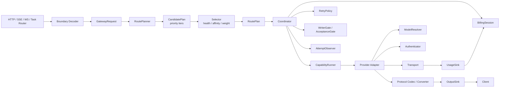

# AI Provider Gateway 核心完整换代设计

> 状态：8+2 核心代码切换完成，待前端依赖修复、生产构建、压测和正式发布
> 范围：普通 HTTP、SSE、OpenAI Responses、Anthropic Messages、Google Gemini、Realtime WebSocket、异步 Task、媒体/原始透传、选路、重试、流、计费和观测
> 交付方式：一次合并、一次数据迁移、一次生产切流；允许实现过程有依赖顺序，不保留长期 v1/v2 双执行链

---

## 1. 结论

现有重构已经完成 Provider 目录、Gateway 资源、加密 Credential、管理探测、凭据轮换、Retry/Stream/Billing 状态机等基础，但生产请求仍由旧链路驱动：

```text
Gin
→ Path2Relay
→ relay.setRequest
→ relay.setProvider
→ ChannelGroup
→ RelayHandler
→ shouldRetry / shouldCooldowns
→ ProviderInterface
```

新的 `RoutePlan`、`Attempt`、`Coordinator`、`Runner` 和 `Observer` 目前没有接管生产请求。核心完整换代必须把生产链改为：

```text
Router Boundary
→ GatewayRequest
→ RoutePlanner
→ Selector
→ RoutePlan
→ Coordinator
→ CapabilityRunner
→ Provider Adapter
→ Authenticator + Transport + Codec
→ WriterGate + UsageSink
→ Billing + Observer
```

切换完成后，旧 Relay 只能剩协议路由薄入口；旧 `ChannelGroup`、胖 `ProviderInterface`、业务 Gin Context 键和手写 retry loop 不再参与请求执行。

---

## 2. “完整换代”的六条硬标准

只有同时满足以下六条，才能称为核心换代完成：

1. **单一执行入口**：所有生产请求都调用同一个 `GatewayEngine.Execute`，不存在普通 Relay、Realtime、Task 各自维护 retry/billing 的分叉。
2. **单一选路源**：运行时只读取 Gateway Endpoint/ModelRoute/Policy/Health 快照，不从 `channels` 表构建候选。
3. **单一 Provider 契约**：核心不再依赖 `providers/base.ProviderInterface`，Provider 不接收 `model.Channel` 和 Gin Context。
4. **单一 Attempt 生命周期**：选路、重试、冷却、输出门闩、usage、计费和观测由 Coordinator 统一拥有。
5. **协议路由可执行**：Protocol Registry 中每条 conversion 必须绑定真实 Converter；不能只声明“兼容”而继续依赖隐藏分支。
6. **旧链删除**：切换后删除旧 retry loop、旧运行时 ChannelGroup、旧 Provider 工厂入口和业务 Context 键，不以 feature flag 长期保留双轨。

---

## 3. 范围和非目标

### 3.1 本次必须覆盖

| 类别 | 请求入口 |
|---|---|
| OpenAI 文本 | completions、chat/completions、responses、responses/compact |
| 四主流协议 | OpenAI Chat、OpenAI Responses、Anthropic Messages、Google Gemini |
| 向量和安全 | embeddings、moderations、rerank |
| 图像 | generations、edits、variations |
| 音频 | transcription、translation、speech |
| 实时 | `/realtime` WebSocket |
| 异步任务 | Suno、Kling、Midjourney、Replicate 等 submit/poll/fetch |
| 原始透传 | files、fine_tuning、assistants、threads、batches、vector_stores |
| 特殊媒体 | Recraft 等原生操作 |

### 3.2 明确不做

- 不把 50 个 Provider 全部强行转换成一个巨大 Canonical IR。
- 不把所有能力塞进一个新的胖 `Adapter` 接口。
- 不允许多跳转换成为默认行为；默认只允许同协议直通或一跳转换。
- 不复制 example 项目的巨型 Manager、全局可变注册表或平台特例中心 switch。
- 不同时调用新旧上游做真实 shadow traffic，避免双计费和副作用。
- 不长期保留 `gateway_v1/gateway_v2` 运行开关。
- 不在核心换代中顺便重做价格体系、用户权限模型或全部管理 UI。

---

## 4. 目标架构



### 4.1 包边界

```text
internal/gateway/
├── domain/          # 稳定值对象和 enum，不依赖 Gin/GORM/Provider
├── engine/          # GatewayEngine 和请求级编排
├── planning/        # RoutePlanner、RouteIndex、CandidatePlan
├── selection/       # Selector、Affinity、HealthStore、CooldownStore
├── execution/       # Coordinator、Attempt、Runner、Observer
├── protocol/        # Protocol Registry、Codec、Converter、StreamFinalizer
├── provider/        # AdapterFactory、CapabilityExecutor、Authenticator
├── transport/       # HTTP/SSE/WS transport
├── stream/          # WriterGate、StreamState
├── billing/         # Request 级 BillingSession
├── telemetry/       # AttemptEvent、metrics、audit
└── compatibility/   # 实施期间临时 LegacyAdapter；切流前必须清空
```

核心包禁止导入：

- `github.com/gin-gonic/gin`
- `gorm.io/gorm`
- `done-hub/model`
- 具体 Provider 包

Router、Repository 和 AdapterFactory 在组合根完成依赖注入。

---

## 5. 核心领域对象

### 5.1 GatewayRequest

Router 只负责鉴权、解析协议入口和创建不可变请求对象：

```go
type GatewayRequest struct {
    RequestID      string
    UserID         int
    TokenID        int
    Group          string
    RequestedModel string
    Capability     Capability
    InboundProtocol Protocol
    Stream         bool
    SpecificEndpointID int
    IgnoreSpecific bool
    Affinity       AffinityKey
    Headers        SafeHeaders
    Payload        PayloadRef
    StartedAt      time.Time
}
```

要求：

- 不保存 `*gin.Context`。
- Header 先经过 allowlist/denylist，禁止把原请求头整体透传。
- Body 由 `PayloadRef` 负责只读和可重放，不靠 Gin Context 缓存键。
- Router 返回错误只处理本地解析和鉴权；上游错误由 Engine 统一输出。

### 5.2 RoutePlan

```go
type RoutePlan struct {
    Request       GatewayRequest
    PublicModel   string
    PriceVersion  string
    Candidates    []CandidateTier
}

type CandidateTier struct {
    Priority  int64
    Endpoints []PlannedEndpoint
}

type PlannedEndpoint struct {
    Endpoint       Endpoint
    UpstreamModel  string
    TargetProtocol Protocol
    Conversion     *ConversionPlan
}
```

Planner 只生成确定性计划，不做随机选择和网络调用。

### 5.3 Attempt

```go
type Attempt struct {
    RequestID string
    Number    int
    Endpoint  PlannedEndpoint
    StartedAt time.Time
}
```

每次候选切换都必须创建新的 Attempt。任何日志、冷却、usage 和账单差异都以 Attempt 为最小单位。

---

## 6. RoutePlanner、Selector 和 Health

### 6.1 RouteIndex

用 Gateway 资源构建不可变索引：

```text
group
└── public model
    └── priority tier
        └── endpoint IDs
```

索引来源：

- GatewayEndpoint
- GatewayModelRoute
- GatewayPolicy
- GatewayHealthState
- Active GatewayCredential 引用

`channels` 表不得参与运行时索引。

### 6.2 Planner 职责

Planner 负责：

- 解析 group fallback。
- 精确模型、大小写兼容和显式 wildcard。
- 验证 capability。
- 验证 inbound/target protocol 是否直通或存在真实 converter。
- 应用 specific endpoint 约束。
- 返回按 priority 分层的候选。
- 区分 `model_not_found` 和 `no_available_endpoint`。

Planner 不负责：

- 权重随机。
- Redis sticky。
- 动态 cooldown。
- 上游调用。

### 6.3 Selector 职责

Selector 在当前 priority tier 内处理：

1. enabled
2. capability
3. protocol
4. health/cooldown
5. skip set
6. specific endpoint
7. affinity/sticky
8. weight

```go
type Selector interface {
    Next(ctx context.Context, plan RoutePlan, state SelectionState) (PlannedEndpoint, error)
}
```

### 6.4 Affinity

Affinity 只用于“同一会话尽量回到同一 Endpoint”，不能绕过健康和权限过滤。

建议提取顺序：

1. 显式 session/conversation ID
2. Responses previous response ID
3. Anthropic/Gemini 可验证会话标识
4. prompt cache key
5. 受控内容 hash fallback

Redis 读取必须发生在 RouteIndex 全局锁之外，避免当前选择过程中持锁做外部 I/O。

### 6.5 HealthStore

区分两类状态：

| 类型 | 示例 | 存储 |
|---|---|---|
| 持久健康 | 最近测试、延迟、余额、人工停用 | DB GatewayHealthState/Endpoint |
| 瞬时运行状态 | cooldown、连续失败、并发槽、sticky | Local/Redis HealthStore |

单实例可用 Local Store，多实例部署必须使用共享 Redis 或数据库实现，否则不同节点会重复打故障上游。

---

## 7. Provider Adapter 设计

### 7.1 删除胖 ProviderInterface

现有 `ProviderInterface` 同时承担 URL、Header、Usage、Context、模型映射、Requester 和能力方法。完整换代后改为组合式契约。

```go
type AdapterFactory interface {
    Create(ctx context.Context, config EndpointConfig) (Adapter, error)
}

type Adapter interface {
    Definition() ProviderDefinition
    Executor(capability Capability) (CapabilityExecutor, bool)
}

type CapabilityExecutor interface {
    Execute(ctx context.Context, attempt AttemptContext, input InputEnvelope, output OutputSink) AttemptResult
}
```

Adapter 不保存：

- `model.Channel`
- `*gin.Context`
- 用户额度
- retry 状态
- 全局 ChannelGroup

### 7.2 可组合组件

```go
type ModelResolver interface {
    Resolve(publicModel string, mapping ModelMapping) (string, error)
}

type EndpointResolver interface {
    Resolve(operation Operation, model string, config EndpointConfig) (url.URL, error)
}

type Authenticator interface {
    Authenticate(ctx context.Context, request *http.Request, credential CredentialMaterial) error
}

type RequestSigner interface {
    Sign(ctx context.Context, request *http.Request, credential CredentialMaterial) error
}

type ErrorDecoder interface {
    Decode(response *http.Response, body []byte) ProviderError
}

type Discoverer interface {
    DiscoverModels(ctx context.Context, config EndpointConfig) ([]DiscoveredModel, error)
}
```

### 7.3 Provider 分类迁移

| 类别 | 迁移方式 |
|---|---|
| OpenAI-compatible | 一个共享 JSON Adapter + Endpoint template + Header Auth，覆盖 OpenAI、Azure、Custom、OpenRouter、xAI、Groq、Mistral 等 |
| 原生 JSON | Claude、Gemini、Baidu、Ali 等使用各自 Codec，复用 Transport/Auth/Error |
| OAuth | Gemini CLI、Claude Code、Codex、Antigravity、Copilot 使用 OAuthAuthenticator，token cache/refresh 不放进 Provider |
| 签名请求 | Bedrock、Hunyuan、Xunfei、Tencent、Kling 使用 RequestSigner |
| Service Account | Gemini/Vertex 使用 ServiceAccountAuthenticator |
| 异步任务/媒体 | Submit/Poll/Fetch capability executor，不强迫实现 Chat |
| Realtime | WebSocketTransport capability executor |

### 7.4 Descriptor 契约

Registry Freeze 时增加校验：

- capability 必须存在对应 executor。
- protocol 必须存在对应 codec。
- auth mode 必须存在 authenticator/signer。
- endpoint template 的 `{model}`、`{region}` 等占位符完整。
- OpenAI-compatible 声明必须通过共享 golden contract。
- Provider ID、ChannelType、capability、protocol、auth mode 不允许重复或空值。

---

## 8. 协议层设计

### 8.1 采用 wire-first，不做全量 IR

推荐顺序：

1. **同协议直通**：保留原始协议字段，性能和语义损失最小。
2. **显式一跳转换**：Chat ↔ Responses、Chat ↔ Claude、Chat ↔ Gemini 等。
3. **受控两跳**：只有已具备 golden test 的 route 才允许，经最小公共 IR。
4. **无 route 即拒绝**：不能因为 Provider 宣称多个协议就猜测兼容。

### 8.2 ConverterSpec 必须绑定实现

```go
type ConverterSpec struct {
    From       Protocol
    To         Protocol
    Quality    ConversionQuality
    Request    RequestConverter
    NonStream  ResponseConverter
    Stream     StreamConverterFactory
}
```

Registry Freeze 时拒绝：

- 只有元数据没有 converter。
- direct 和 steps 同时存在。
- step 首尾协议不连续。
- 重复 route。
- stream route 没有 finalizer。

### 8.3 最小公共 IR

只覆盖四文本协议的共同子集：

- text/image content
- system/instructions
- reasoning/thinking
- tool declaration/call/result
- finish reason/status
- input/output/cache/reasoning usage
- provider error

协议专用字段保存在 `RawExtensions`，例如：

- Responses `previous_response_id`
- Claude `cache_control`
- Gemini `thoughtSignature`
- Provider namespace tools

### 8.4 Stream 生命周期

每个 Stream Converter 必须实现：

```go
type StreamConverter interface {
    ConvertChunk(chunk []byte) ([]ClientEvent, error)
    Finalize(reason TerminalReason) ([]ClientEvent, FinalUsage, error)
}
```

不变量：

- terminal event 只能出现一次。
- EOF、upstream error、客户端取消、truncated 必须显式区分。
- usage 只完成一次。
- Responses 失败输出 `response.failed`，而不是泛化 `event:error`。
- Claude/Gemini/OpenAI 的 finish reason 必须有固定映射。

---

## 9. Coordinator 和 Attempt 生命周期

### 9.1 Coordinator 唯一所有权

Coordinator 统一拥有：

- attempt budget
- request deadline
- candidate skip set
- RetryPolicy
- cooldown
- WriterGate/AcceptanceGate
- BillingSession
- UsageSink
- AttemptObserver
- 最终响应和错误映射

Router、Provider 和 Runner 不得自行 retry。

### 9.2 执行伪代码

```go
func (e *Engine) Execute(ctx context.Context, request GatewayRequest, sink OutputSink) Result {
    plan := e.planner.Plan(request)
    billing := e.billing.Begin(request, plan)
    state := NewExecutionState(plan)

    for state.CanAttempt() {
        endpoint := e.selector.Next(ctx, plan, state.Selection())
        attempt := state.BeginAttempt(endpoint)
        gate := e.gates.New(request.Capability)
        usage := e.usage.NewAttemptSink(attempt)

        result := e.runner.Execute(ctx, attempt, gate, usage, sink)
        decision := e.retry.Decide(result.Error, RetryContext{
            Attempt:       attempt.Number,
            MaxAttempts:   state.MaxAttempts(),
            OutputStarted: gate.VisibleOutputStarted(),
            Accepted:      gate.UpstreamAccepted(),
        })

        e.observer.AttemptFinished(attempt, result, decision)
        state.Record(result, decision)

        if result.Success {
            billing.Settle(usage.Final(), OutcomeSucceeded)
            return result
        }
        if !decision.Retry {
            billing.FinalizeFailure(usage, result)
            return result
        }
        e.health.Cooldown(endpoint, decision)
    }

    billing.RefundIfReserved("attempts_exhausted")
    return NoAvailableEndpoint()
}
```

### 9.3 不变量

1. 一个用户请求最多一次 Precharge。
2. Settled 和 Refunded 互斥且幂等。
3. 只有未产生客户端可见输出且上游未产生不可逆副作用时才能 failover。
4. attempt 数不超过 `min(config, available candidates)`。
5. specific endpoint 默认不重试，除非显式 ignore。
6. deadline 到期后不能继续调用 Runner。
7. 每个 Attempt 都有 started 和唯一 terminal event。
8. usage 必须归属明确的 Attempt，并最终汇总到请求级账单。

---

## 10. 不同能力的 Gate

不能只用 HTTP WriterGate 覆盖所有能力，需保留统一语义下的不同 Gate。

| 能力 | 不可重试边界 |
|---|---|
| Unary JSON | 客户端响应已写出，或上游确认产生不可逆副作用 |
| SSE | header/首个事件写出 |
| Responses stream | 首个 response event 写出 |
| Realtime WS | 上游输出已转发；客户端 upgrade 本身不等于上游已输出 |
| Async Task | 上游已接受并返回 task/job ID |
| 文件/批处理 | 上游确认上传/创建成功 |
| 原始透传 | 首字节写出，或非幂等操作已接受 |

### 10.1 Realtime

RealtimeRunner 负责：

- 先选择 Endpoint。
- 建立上游连接。
- 客户端 upgrade 后可缓存首条消息。
- 在任何上游输出转发前允许重新拨号候选。
- 一旦转发上游 frame，WriterGate 锁定。
- user close → OutcomeCanceled。
- provider close → 根据协议终止状态决定 Succeeded/Failed。
- WebSocket Origin 采用配置化 allowlist，禁止 `CheckOrigin=true`。

### 10.2 Async Task

TaskRunner 负责：

- `Submit`、`Poll`、`Fetch` 明确分离。
- Submit 返回上游 task ID 后设置 AcceptanceGate。
- AcceptanceGate 锁定后禁止换 Provider，避免创建重复任务。
- Task quota 使用真实计费规则，不固定假设 1000 token。
- Task 状态记录 Endpoint/Provider/credential version，后续 Poll 必须回到原上游。

### 10.3 Passthrough

- 必须指定 Endpoint 或有明确 route。
- 默认不重试非幂等操作。
- Header deny-by-default。
- multipart/body 必须支持安全重放；无法重放则 attempt budget=1。

---

## 11. Billing 和 Usage

### 11.1 BillingSession

BillingSession 是请求级对象，不属于 Provider：

```text
New
→ Reserved
→ Settled
或
→ Refunded
```

Attempt 切换不重新预扣，只更新当前 Endpoint/模型的 reservation owner 元数据。

### 11.2 UsageSink

统一支持：

- prompt/input tokens
- completion/output tokens
- cached read/write
- reasoning/thinking
- image/audio seconds or units
- task/media fixed unit
- provider 原始 usage

Provider Codec 只提交 usage 事实；价格和额度计算由 Billing 层完成。

### 11.3 失败结算

| 情况 | 处理 |
|---|---|
| 本地校验失败 | 不预扣 |
| 预扣失败 | 终止，不调用上游 |
| 上游失败、无输出、可重试 | 保留 reservation，切 Attempt |
| 上游失败、已有 usage/不可逆接受 | Settle Failed |
| 全部失败且无实际消费 | Refund |
| 客户端取消但上游已消费 | Settle Canceled |
| 重复 settle/refund | 幂等，不重复写额度 |

---

## 12. 可观测性

### 12.1 AttemptEvent

```go
type AttemptEvent struct {
    RequestID       string
    Attempt         int
    ProviderID      string
    EndpointID      int
    CredentialID    uint
    PublicModel     string
    UpstreamModel   string
    InboundProtocol Protocol
    TargetProtocol  Protocol
    Conversion      string
    Outcome         string
    ErrorClass      string
    StatusCode      int
    Retry           bool
    Cooldown        time.Duration
    OutputStarted   bool
    UpstreamAccepted bool
    Usage           Usage
    StartedAt       time.Time
    CompletedAt     time.Time
}
```

### 12.2 必须指标

- request/attempt success rate
- P50/P95 TTFB 和 TTLB
- retry count
- attempts exhausted
- cooldown count/duration
- auth/rate limit/5xx/protocol error
- output gate locked
- stream terminal reason
- billing reserved/settled/refunded/error
- usage source/provider/fallback
- candidate count/selection latency
- sticky hit/miss

Secret、Authorization、完整请求 Body 不得成为 label 或日志字段。

---

## 13. 生产入口迁移矩阵

| 入口 | Runner | Protocol/Codec | 特殊约束 |
|---|---|---|---|
| Chat/Completions | Unary/StreamRunner | OpenAI Chat | token limit、tool、stream |
| Responses | Unary/StreamRunner | Responses | item state、failed/incomplete |
| Responses Compact | UnaryRunner | Responses Compact | 非流、Profile 强约束 |
| Claude Messages | Unary/StreamRunner | Claude | thinking、Claude error/SSE |
| Gemini | Unary/StreamRunner | Gemini | URL model/action、thoughtSignature |
| Embeddings/Moderations | UnaryRunner | Provider native/OpenAI | 无流 |
| Image/Audio | Binary/MultipartRunner | capability codec | body replay、unit usage |
| Rerank | UnaryRunner | typed rerank | typed score response |
| Realtime | RealtimeRunner | WS codec | frame gate、origin |
| Async Task | AsyncTaskRunner | submit/poll/fetch | acceptance gate |
| Passthrough | RawRunner | raw | specified endpoint、幂等限制 |

所有 router 最终只能做：

```go
request, err := boundary.Decode(c)
result := gatewayEngine.Execute(c.Request.Context(), request, boundary.Output(c))
boundary.Finish(c, result)
```

---

## 14. 数据迁移和一次性切换

### 14.1 切换前数据要求

- 所有启用连接都有 GatewayEndpoint。
- 所有 Endpoint 都有合法 active credential，包括 AuthModeNone sentinel。
- 所有公开模型都有 GatewayModelRoute。
- 所有 Profile 能解析到 target protocol，原生 Provider 明确标记 ProtocolNative。
- Endpoint/Route/Policy/Health 与旧 Channel 对账。
- 不存在未知 ChannelType。
- 不存在无法解密的 active credential。

### 14.2 禁止双写

实施过程中可以有临时 LegacyAdapter，但不允许：

- 新旧 Engine 同时真实请求上游。
- 新旧 Billing 同时扣费。
- Channel 和 Gateway resource 各自独立接受写入。
- 两套 cooldown/sticky 同时生效。
- Provider 自己 retry，外层 Coordinator 再 retry。

管理写入必须先进入 Gateway Connection Service；兼容 Channel API 只是 DTO adapter。

### 14.3 Shadow 验证

允许只读 shadow：

- 旧 ChannelGroup 产生候选 ID。
- 新 Planner/Selector 使用同一请求元数据产生候选 ID。
- 比较模型、priority tier、过滤原因和首选 Endpoint。

禁止 shadow 调用真实 Provider。

### 14.4 切流步骤

1. 停止管理面写入。
2. 创建数据库快照和加密备份。
3. 执行幂等迁移。
4. 对账 Channel/Endpoint/Credential/Route/Policy/Health。
5. 运行 shadow planner diff，要求差异有明确白名单。
6. 部署只包含新 Engine 的二进制。
7. 所有入口一次性切到 GatewayEngine。
8. 恢复管理写入。
9. 观察 SLO 和账单差异。
10. 观察窗通过后删除临时 LegacyAdapter 和 downgrade 数据。

这是一套切换事务，不是按 Provider 或租户长期灰度。

### 14.5 回滚

必须实际演练两条回滚路径：

**短观察窗回滚**

- 停写。
- 恢复切流前数据库快照。
- 部署旧二进制。
- 丢弃观察窗内配置写入，业务影响需提前声明。

**受控向下迁移**

- 特权工具把 active encrypted credential 临时解密写回旧 `channels.key`。
- 记录审计、限制执行主机和有效期。
- 部署旧二进制。
- 故障解除后重新清除明文。

没有成功演练的回滚脚本，不允许生产切流。

---

## 15. 一次性交付任务清单

以下是实现依赖顺序，不是分阶段发布；全部完成后才允许一次切流。

### 15.1 核心契约

- [x] 固化 GatewayRequest、RoutePlan、Attempt、Result、Usage。
- [x] 新建 GatewayEngine。
- [x] 删除 domain 对 Gin/GORM/model 的潜在依赖。
- [x] 建立 HTTP/SSE/WS/Task boundary 和输出门闩。

### 15.2 Planner/Selector/Health

- [x] 从 Gateway resources 构建原子发布的 RouteIndex。
- [x] 保留 group/model/priority/weight/wildcard/OnlyChat/stream 语义。
- [x] 实现 specific endpoint、类型化 skip set、affinity。
- [x] Redis sticky 移出全局读锁。
- [x] 引入统一 CooldownStore。
- [ ] 非 master 节点支持版本化快照刷新。

### 15.3 Protocol

- [x] Registry route 必须绑定可执行 Converter。
- [x] 完成 Chat ↔ Responses。
- [x] 完成 Chat ↔ Claude。
- [x] 完成 Chat ↔ Gemini。
- [x] 完成必要的 Claude → Gemini。
- [x] 统一 stream terminal/finalizer/usage 门闩。
- [x] 默认禁止未经验证的多跳。

### 15.4 Provider

- [x] 定义 AdapterFactory 和组合式 Capability 接口。
- [ ] 抽离 EndpointResolver、ModelResolver、Authenticator、Signer、Transport、ErrorDecoder。
- [ ] 先迁移共享 OpenAI-compatible family。
- [ ] 迁移 Claude/Gemini 原生 family。
- [ ] 迁移 OAuth、Signer、Service Account family。
- [ ] 迁移媒体、Task、Realtime、Passthrough capability。
- [x] 全部现有 descriptor 通过注册与能力契约。
- [x] 删除胖 ProviderInterface；Provider 内部 URI 解析保留为协议实现细节。

### 15.5 Lifecycle

- [x] GatewayEngine 接管 attempt budget/deadline/retry/cooldown。
- [x] 普通/SSE 接入 WriterGate。
- [x] Realtime 接入 frame gate。
- [x] Task/非幂等操作接入 AcceptanceGate。
- [x] 统一 Usage 聚合。
- [x] 统一请求级 BillingSession 终态和幂等约束。
- [x] 接入 AttemptObserver。

### 15.6 生产入口

- [x] OpenAI 普通入口全部接 Engine。
- [x] Responses/Compact 接 Engine。
- [x] Claude/Gemini 接 Engine。
- [x] Image/Audio/Embedding/Moderation/Rerank 接 Engine。
- [x] Realtime 接 Engine。
- [x] Suno/Kling/Midjourney/其他 Task 接 Engine。
- [x] Raw passthrough 接 Engine。
- [x] 删除 Gateway 层旧手写 retry loop；Provider 内部 OAuth/SDK 传输重试不计作跨端点 failover。

### 15.7 管理和数据

- [x] Gateway Connection 写边界统一事务提交 source row 和运行投影。
- [x] 旧 Channel API 只做兼容 DTO，并复用相同校验与写边界。
- [x] 清除选路运行时对 `channels.key/models/group` 的读取。
- [x] 迁移提交 marker 前校验资源计数、活动凭据引用和旧表明文清零。
- [x] 实现一次性 migration/cutover marker；不保留运行时 shadow 双写。

### 15.8 删除旧链

- [x] 删除运行时 ChannelGroup/ChannelsChooser 命名和旧表装载。
- [x] 删除胖 ProviderInterface。
- [x] RelayBase 只组合所需 Capability。
- [x] 协议、attempt、skip、选中端点、stream 和 billing 不再通过 Gin 字符串键共享。
- [x] 删除 shouldRetry/shouldCooldowns 手写循环。
- [x] 删除 Coordinator 兼容别名、gincontext 生产桥和 LegacyAdapter 残留。

---

## 16. 测试矩阵

### 16.1 Contract

- 50 个 Provider descriptor。
- capability ↔ executor。
- protocol ↔ codec。
- auth mode ↔ authenticator。
- endpoint template。
- error decoder。

### 16.2 Protocol golden

四协议每个方向至少覆盖：

- request
- non-stream response
- stream text
- multi-choice
- reasoning/thinking
- tool call/result
- image content
- cache/reasoning usage
- no usage
- truncated EOF
- upstream error
- client cancel
- terminal event exactly once

ID、时间戳等不稳定字段在 golden 中归一化。

### 16.3 Selection

- priority 降级
- weight 分布和 weight=0 默认
- wildcard/大小写
- group fallback
- cooldown
- sticky 命中和失效
- specific endpoint
- skip set
- capability/protocol filter
- snapshot 原子替换
- 多节点共享 health

### 16.4 Lifecycle

- precharge exactly once
- settle/refund exactly once
- retry reservation transfer
- output 后禁止 retry
- task accepted 后禁止 retry
- realtime 首帧后禁止 retry
- exhausted/timeout/provider error
- usage with failed attempt
- billing operation failure

### 16.5 E2E

使用本地 fake upstream，不依赖公网：

- 四协议 create/probe/request/stream
- OpenAI-compatible
- OAuth refresh
- SigV4 golden
- keyless Ollama
- credential rotation
- admin CRUD
- non-master snapshot sync
- Realtime WS
- Task submit/poll
- passthrough multipart

### 16.6 性能

必须新增 benchmark：

- RouteIndex build
- Planner 10/100/1000/10000 endpoints
- Selector with filters/sticky
- stream conversion allocations
- Relay v1 vs GatewayEngine 吞吐/P50/P95/内存
- config incremental sync

---

## 17. 阻断式验收标准

### 17.1 代码结构

以下搜索必须为零或只存在于迁移工具：

```text
providers/base.ProviderInterface
model.ChannelGroup
shouldRetry(
shouldCooldowns(
specific_channel_id context key
channel_type context key
gatewayBillingSessionKey
```

`internal/gateway` 生产代码不得导入 Gin、GORM、model。

### 17.2 正确性

- 所有生产入口只调用 GatewayEngine。
- 所有 Protocol route 都有 executable converter。
- 所有 Provider capability 都有 contract test。
- 同一请求不重复上游副作用。
- 流 terminal exactly once。
- Billing 差额为零。
- Shadow planner 非白名单 diff 为零。

### 17.3 质量

```text
go test ./...
go test -race ./...
go vet ./...
frontend production build
browser E2E
protocol golden
migration/rollback rehearsal
```

全部通过，不接受“核心包通过但全仓有已知阻断”作为生产验收。

### 17.4 性能

- 新 Engine P95 不高于旧链 5%。
- 吞吐不低于旧链。
- 内存/请求不高于旧链 10%。
- 1000 Endpoint 选路不产生数据库查询。
- Redis sticky 故障时可降级且不阻塞全局选择锁。

### 17.5 安全

- DB、日志、错误、metrics、普通 API 不出现明文 Secret。
- WebSocket Origin 有明确策略。
- Header passthrough deny-by-default。
- 自定义 BaseURL 经过 SSRF 校验。
- rollback 工具受权限和审计控制。

---

## 18. 工作量评估

按个人维护、现有 50 个 Provider、要求一次切换估算：

| 工作 | 人日 |
|---|---:|
| Engine/领域契约/边界 | 4–6 |
| Planner/Selector/Health | 4–6 |
| 四协议 Converter/Stream | 7–10 |
| Provider 组件化迁移 | 10–15 |
| 普通/Realtime/Task/Raw 入口接管 | 6–9 |
| Billing/Observer/metrics | 3–5 |
| 数据迁移、shadow、rollback | 3–5 |
| Golden/E2E/race/benchmark | 7–10 |
| 合计 | **44–66 人日** |

如果保持单人维护，合理日历时间约 9–14 周。压缩工期只能通过减少 Provider/能力覆盖，不能通过省略 E2E、回滚或双扣费验证。

---

## 19. 主要风险

| 风险 | 严重度 | 控制 |
|---|---|---|
| 50 Provider 隐含行为没有 contract | 高 | legacy parity golden + family adapter |
| 协议转换丢 tool/reasoning/cache 字段 | 高 | wire-first + RawExtensions + golden |
| Task/文件操作重复提交 | 高 | AcceptanceGate |
| 流已输出后误重试 | 高 | WriterGate 是 Coordinator 唯一依据 |
| 重试导致重复扣费/退款 | 高 | 请求级 BillingSession + exactly-once |
| 多节点 cooldown 不一致 | 中高 | Shared HealthStore |
| Gin Context 键遗漏导致语义变化 | 中高 | typed GatewayRequest + 旧键零命中验收 |
| 切换后无法回滚 | 高 | DB snapshot + downgrade 工具演练 |
| 新旧双写产生资源分叉 | 高 | 单写服务 + 切流前删除双写 |
| 大规模选路性能退化 | 中 | RouteIndex benchmark + 无 DB 热路径 |

---

## 20. 小功能改造前后差异

本章是实施和验收的逐项对照表。任何一项如果仍停留在“改造前”，都不能宣称核心完整换代完成。

| 小功能 | 改造前 | 改造后 |
|---|---|---|
| 请求入口 | 各 Router/Relay 自己解析并写 Gin Context | Boundary 只生成 typed `GatewayRequest`，统一调用 `GatewayEngine` |
| 请求状态 | `specific_channel_id`、`channel_type` 等字符串键隐式传递 | 显式字段和不可变值对象，编译期可发现遗漏 |
| OpenAI Chat | 旧 Relay 直接驱动 Provider | Chat codec + 通用 Unary/StreamRunner |
| OpenAI Responses | 独立分支与 Chat 重试/流语义可能漂移 | Responses codec 复用同一 Coordinator 生命周期 |
| Anthropic Messages | Provider/relay 内包含协议和错误特例 | Claude codec、error decoder 和 adapter 分层 |
| Google Gemini | URL action、model、thoughtSignature 分散处理 | Gemini endpoint/model resolver + codec 统一处理 |
| 协议选择 | Profile 主要描述兼容性，执行仍靠隐藏 switch | Registry 每条 route 必须绑定可执行 Converter |
| 协议转换 | 转换方向和字段保真没有统一约束 | 一跳优先、golden 验证、`RawExtensions` 保留专有字段 |
| 多跳转换 | 可能由调用链隐式形成 | 默认禁止，仅明确登记且有 golden 的路径可用 |
| SSE 流 | 不同 Provider 各自判断首字节、终止和 usage | `WriterGate + StreamFinalizer + UsageSink` 统一 |
| Realtime | 独立选路、重试和计费循环 | `RealtimeRunner` 使用同一 Plan/Attempt/Billing，只替换 frame gate |
| 异步 Task | submit/poll/fetch 各有状态和重试规则 | `AsyncTaskRunner + AcceptanceGate` 防止重复提交 |
| Raw passthrough | 特殊入口绕开部分核心约束 | `RawRunner` 仍经过选路、认证、计费和观测 |
| Multipart/Binary | body 重放能力由具体 Relay 假定 | Runner 显式声明 replayability，决定能否重试 |
| 模型路由 | 运行时依赖 Channel 字段和兼容过滤 | 只读版本化 `RouteIndex` 中的 `ModelRoute` |
| 指定连接 | 依赖 Context 键和旧过滤分支 | `SelectionConstraint.SpecificEndpointID` |
| 优先级/权重 | `ChannelGroup` 内部实现 | Selector 契约化并用确定性测试锁定语义 |
| wildcard/case | 散落在模型匹配逻辑 | Planner 统一规范化和解释过滤原因 |
| sticky | Redis 查询可能参与旧选择临界区 | Affinity 接口独立，Redis I/O 不持有全局选择锁 |
| cooldown | 普通、Realtime、Task 语义不一致 | Coordinator 唯一写入 `HealthStore/CooldownStore` |
| 重试决策 | `shouldRetry`、`shouldCooldowns` 和新 Policy 并存 | 单一 `RetryPolicy` 返回 retry/delay/cooldown/reason |
| 重试执行 | Policy 部分结果未被主循环消费 | Coordinator 完整执行 decision，Provider 禁止自重试 |
| 输出后失败 | 依赖分支自行判断能否换端点 | Gate 一旦 committed，禁止透明重试 |
| Provider 创建 | `Create(*model.Channel)` 绑定数据库模型 | `AdapterFactory.Create(EndpointSnapshot)` |
| Provider 能力 | 一个胖 `ProviderInterface` 承载所有能力 | 按 capability 组合 executor，不支持即显式拒绝 |
| OpenAI-compatible | 多个 Provider 重复 URI/header/model 样板 | 共享 family adapter，仅 descriptor 描述差异 |
| Endpoint 解析 | `GetAPIUri(relayMode)` 大 switch | `EndpointResolver` 按 family/capability 组合 |
| 模型映射 | Provider/Relay 各自处理 | `ModelResolver` 单一职责、可独立测试 |
| API Key 认证 | Channel 明文/Provider 拼 header 的历史耦合 | Credential lease + `Authenticator`，业务表无 Secret |
| OAuth/签名/服务账号 | 特例混入 Provider 主实现 | OAuth、Signer、ServiceAccount 独立组件 |
| 上游错误 | HTTP、协议错误和 retry 判断相互耦合 | `ErrorDecoder` 归一为 typed failure，再交 Policy |
| usage 采集 | 流、非流、失败 attempt 路径不一致 | 所有 Runner 只向请求级 `UsageSink` 上报 |
| 计费 | 多入口各自结算，attempt usage 容易覆盖 | 一个请求一个 `BillingSession`，attempt 累加且 exactly-once settle |
| 凭据轮换 | 兼容表可能继续承担运行时权威 | Endpoint 仅引用 active credential，旧表只作迁移输入 |
| AuthModeNone | `active_credential_id=0` 与加载/启用校验冲突 | 使用显式 none credential/sentinel，生命周期一致 |
| 管理面写入 | Channel/Gateway resource 可能双写或回填 | Gateway Connection Service 单写，旧 API 仅 DTO adapter |
| 资源刷新 | 渠道变更可能触发全表 backfill/load | 增量写入 + 事务提交后发布版本化不可变快照 |
| 多节点同步 | 旧内存池和节点状态可能漂移 | snapshot version + shared health/cooldown |
| 可观测性 | 日志围绕 channel/error，难还原 attempt | `AttemptEvent` 记录 plan、过滤、重试、提交、usage、结算 |
| 故障定位 | “channel not implemented”等错误语义宽泛 | descriptor/capability/credential/protocol 各有稳定错误码 |
| Provider 扩展 | 改 factory、switch、relay、UI 多处 | 注册 descriptor + 组合组件 + contract test |
| 测试 | 以局部单测为主，入口语义易漂移 | contract + protocol golden + lifecycle + E2E + race + benchmark |
| 数据迁移 | 运行时 backfill 与业务操作纠缠 | 离线幂等迁移、checksum 对账、切流时禁止双写 |
| 回滚 | 依赖旧表仍可侥幸启动 | DB snapshot 和受控 downgrade 两条路径实际演练 |
| 旧代码退出 | 新抽象与旧主循环并存 | 零命中验收并删除 ChannelGroup、胖接口和手写循环 |

## 21. 预期收益和量化方法

以下是基于目标结构的工程估算，不是未测量情况下的性能承诺。切流前必须用同一份流量样本建立旧链基线，再由 benchmark、shadow diff 和 E2E 给出实测值。

| 维度 | 预计结果 | 如何验收 |
|---|---|---|
| 网关编排代码 | retry/stream/billing/selection 重复代码减少 **35%–50%** | 按职责统计删除的旧循环、分支和 Context 状态，不以总代码行数单独判断 |
| Provider 样板代码 | family 内 URI/header/auth/model 重复减少 **20%–35%** | 比较迁移前后 provider 目录的重复块和圈复杂度 |
| 全仓代码量 | 预计净减少 **3%–8%** | 新契约和测试会增加代码，因此只把净减少作为参考指标 |
| 新增普通 Provider 改动面 | 从修改约 4–8 个位置降为 descriptor、组件组合、契约测试约 2–3 处 | 用一个 OpenAI-compatible Provider 做盲测扩展 |
| 配置完成时间 | 四主流连接预计减少 **30%–50%** | 10 次同任务可用性测试：创建、探测、启用、模型可用 |
| 配置错误发现时间 | 从首次业务请求时发现，变为保存/启用前发现 | 无有效 credential/profile/model route 的连接不得入池 |
| 选路 CPU/锁竞争 | 1000 Endpoint 压测预计改善 **15%–35%** | 与旧 ChannelGroup 做同机 benchmark；Redis 故障不得扩大锁等待 |
| 整体请求 P95 | 上游占主导，预计改善仅 **0%–5%** | 端到端回放；硬门槛是不比旧链恶化 5% |
| 管理面刷新抖动 | 删除全表 backfill 后，连接变更耗时预计减少 **50%–90%** | 100/1000 Endpoint 下测单连接新增、编辑、轮换和禁用 |
| 配置类故障 | 预计减少 **40%–70%** | 对比 unknown type、空凭据、无 route、profile 不匹配等故障样本 |
| 重试/流/Task 重复副作用 | 设计目标为已覆盖故障模型下 **归零** | fault injection 验证输出后不重试、accepted task 不重复 submit |
| 重复扣费/漏结算 | 设计目标为测试矩阵内 **归零** | 每种成功/失败/重试/断流场景核对 ledger 与上游 usage |
| 平均定位时间 MTTR | 预计减少 **30%–60%** | 演练 credential、限流、协议转换、上游 5xx、多节点 cooldown 故障 |

总体判断：

- **瘦身**主要发生在编排重复和 Provider 样板，不应追求“总代码砍半”；完整契约测试会抵消部分行数，但复杂度会显著下降。
- **流畅度**的主要收益是管理变更、选路锁竞争和故障恢复；大模型响应时间由上游主导，不能宣称端到端快很多。
- **配置便利度**的主要收益来自四主流协议模板、预检、原子启用和稳定错误定位；目标是把“能否工作”从试请求猜测变为启用前确定。
- **错误减少**可以对结构性故障给出强保证，对上游限流、网络和 Provider 行为变化只能降低影响和缩短定位时间，不能承诺消失。

如果实测未达到区间下限，不直接判定架构失败，但必须给出瓶颈证据；若触发第 17 章的正确性、安全或性能硬门槛，则必须阻断切流。

## 22. 最终验收语句

完整换代完成后，一次请求从进入 Router 到最终响应、重试、流终止、计费和观测，只存在一条 GatewayEngine 执行链；新增普通 Provider 只需注册 descriptor、组合认证/传输/协议组件并通过契约测试，不修改核心 Router、Selector、Coordinator、Billing 或数据库 Channel 结构。
