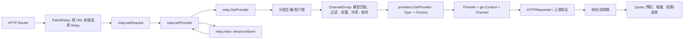
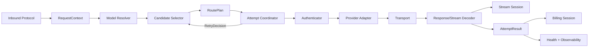

# AI 网关（AI Provider）调研、重构实施与改进评估

> 调研日期：2026-07-31
> 调研范围：当前仓库与 `example/CLIProxyAPI`、`example/new-api`、`example/sub2api` 的后端实现。
> 实施日期：2026-07-31
> 文档性质：调研基线、目标架构、一次性实施方案、逐项前后差异、收益评估与本次代码落地记录。
>
> 注意：第 1～5 章中的“当前项目”描述是重构前基线，用于解释改动原因；实际落地状态以第 15 章为准。

## 0. 先给结论

当前项目的主要落后点不是 Provider 数量，而是 **Provider、Channel、模型路由、协议转换、重试、计费和 HTTP 请求上下文没有清晰分层**。从代码结构看，继续添加渠道很可能把复杂度继续推到 `relay`、`model.Channel` 和全局 `gin.Context`，最终形成“每个新渠道都能接入，但核心链路越来越难动”的维护风险。

建议把 AI 网关收敛为五个稳定边界：

1. **请求协议层**：解析客户端请求，得到统一的 `RequestContext`，不选择渠道、不计费。
2. **路由与调度层**：根据模型、分组、能力、健康、权重、粘性和策略生成 `RoutePlan`，不拼 URL、不改请求体。
3. **Provider Adapter 层**：只负责某个上游协议的认证、URL、请求/响应转换、流事件和用量提取。
4. **执行控制层**：负责 attempt、错误分类、重试/冷却、流开始门闩和最终响应写出。
5. **计费与观测层**：以不可变快照接收结果，独立于 Gin、Provider 具体类型和重试循环。

本方案不采用按阶段、按 Provider 批次或新旧路径长期并行的迁移方式。一次性完成网关核心模块、全部现有 Provider 的适配、领域对象替换、协议转换、计费与测试，然后以一次发布/切换完成替换；旧 `Channel` 仅作为数据兼容输入，不作为新执行链路的运行时依赖。这样可以一次性关闭历史边界，避免兼容层长期存在并继续产生分叉行为。

目标不是复制任何一个参考项目，而是组合它们的有效机制：

- 借 CLIProxyAPI 的 **窄执行契约、Selector、Model Registry、生命周期 Hook**；
- 借 new-api 的 **Adaptor 生命周期、协议转换注册表、转换质量/多跳描述**；
- 借 sub2api 的 **账号资源模型、并发槽位、粘性会话、结构化 failover 错误、流开始后的终止事件**；
- 不照搬三者各自的 **巨型 Manager/Adaptor/RelayInfo、全局可变注册表、平台特例堆积和明文凭据 JSONB**。

---

## 1. 调研方法与量化基线

### 1.1 统一比较维度

对四个项目按同一组问题核对：

- Provider/Adapter 的最小执行契约是什么？
- Channel、Credential、Model、Route、Health、Billing 是否分离？
- 模型发现与选择在哪里完成？
- 请求/响应协议转换是否有显式注册表？流式转换是否有状态机？
- 认证、代理、HTTP transport 是否独立于业务转换？
- 重试、冷却、failover 是否按错误类别决策？
- HTTP 200/流已开始后如何处理错误？
- 计费是否跨 attempt 正确结算？
- 扩展一个 Provider 需要改多少个中心文件？
- 测试是否覆盖契约、协议、重试、流和计费，而不是只测个别 Provider？

### 1.2 数量基线

以下数字由当前工作区的 `find`/`rg` 只读统计得到；它们衡量规模，不代表质量或覆盖率。

| 项目 | Go 文件 | `*_test.go` 文件 | Provider/Channel 相关规模 |
|---|---:|---:|---|
| 当前 done-hub（排除 `example`） | 502 | 14 | `providers/` 顶层 46 个目录；Provider 测试文件 5 个 |
| CLIProxyAPI | 1005 | 406 | `internal/auth/` 7 个 Provider 认证目录 |
| new-api | 769 | 140 | `relay/channel/` 40 个渠道目录；渠道测试文件 22 个 |
| sub2api backend | 2177 | 993 | 以 `Account + Platform + Gateway` 为中心，非按 Provider 目录平铺 |

当前项目总文件并不小，但只有 14 个测试文件（其中 Provider 目录 5 个），且没有一组统一的“注册矩阵、能力矩阵、重试决策、流状态、计费不变量”测试。这是需要补证的规模信号，不能单凭文件数量推出覆盖率或质量差距。

---

## 2. 当前项目（1）的真实调用链



### 2.1 入口与 Relay 分派

- `router/relay-router.go:32-58` 把 `/v1` 统一入口指向 `relay.Relay`，Claude、Gemini、MJ、Suno、Kling 等又各自建立一组路由；认证、分发和限流在路由中间件完成。
- `relay/common.go:31-69` 的 `Path2Relay` 使用一串 `strings.HasPrefix` 选择 `relayChat`、`relayResponses`、`relayGemini` 等实现。路径、协议、业务能力的映射没有独立注册表。
- 同一个 Provider 可能从多个入口被调用，入口差异通过 `gin.Context` 字符串键传递，而不是通过明确的请求对象表达。

### 2.2 Provider 注册与契约

- `providers/providers.go:55-58` 定义 `ProviderFactory`，`providers/providers.go:65-110` 在一个文件中手工导入并注册全部 Factory，`providers/providers.go:114-129` 再按整数 `ChannelType` 创建 Provider。
- 未知 `ChannelType` 只要有 `BaseURL` 就回退为 OpenAI Provider（`providers/providers.go:114-124`）。这意味着“未注册/拼写错误/迁移遗漏”可能被解释成 OpenAI 兼容，掩盖配置错误；是否接受这种兼容行为应由显式 descriptor/配置策略决定，而不是由工厂默认兜底。
- `providers/base/interface.go:18-48` 的 `ProviderInterface` 同时承载 headers、usage、Gin Context、原始/响应模型、Channel、模型映射、Requester、自定义参数和响应能力；其后又叠加 Chat、Completion、Embedding、Responses、图片、音频等多个能力接口（`providers/base/interface.go:51-155`）。
- `providers/base/common.go:368-379` 让 Provider 保存 `*gin.Context`；`providers/base/common.go:489-525` 又从 Channel 读取模型映射和自定义参数。Provider 因而直接依赖 Web 框架和数据库实体，生命周期、并发和后台复用语义需要单独审计。

### 2.3 Channel 同时是配置、凭据、路由和运行状态

`model/channel.go:18-56` 的 `Channel` 至少同时承载：

- 身份与凭据：`Type`、`Key`、`BaseURL`、`Proxy`；
- 暴露与路由：`Models`、`Group`、`Weight`、`Priority`、`Tag`；
- 协议行为：`ModelMapping`、`Need2ResponseModels`、`ModelHeaders`、`CustomParameter`、`HeaderOverride`、`PassThroughBody`、`CompatibleResponse`、`AllowExtraBody`、`DisabledStream`、`Plugin`；
- 计费与运营：`UsedQuota`、`PreCost`、`CostRatio`、`Balance`、`ResponseTime`、`Status`。

这不是简单的“字段多”，而是一个数据库实体拥有了至少六种变化速度不同的责任。任何新功能都只能继续加字段或把 JSON 塞进 `Other/Plugin/CustomParameter`。

### 2.4 选择、降级和重试边界混在一起

- `model/balancer.go:51-59` 的 `ChannelsChooser` 同时保存渠道、分组/模型规则、通配匹配和冷却；`model/balancer.go:699-759` 又负责粘性会话、冷却过滤、权重抽样和写回粘性映射。
- `model/balancer.go:762-803` 负责模型名匹配，`model/balancer.go:856-883` 负责已验证模型的渠道选择；选择器直接接收 `ginContext interface{}` 以生成会话哈希。
- `relay/common.go:169-307` 的 `GetProvider` 一次性完成 token 模型限制、分组主/备/用户链、分组缺失判定、模型匹配、渠道选择、Context 状态写入、Provider 创建、模型映射和计费原模型标记。
- `relay/main.go:76-188` 在一次请求里再次计算可用渠道、控制重试次数、调用 `setProvider`、更新 skip 列表、冷却渠道、记录 retry 日志；`relay/main.go:351-411` 再按 Retry-After/状态码决定冷却。

因此在当前代码中未发现统一的“一个 attempt”领域对象：渠道、上游模型、分组、错误、是否已写流、计费快照分别散落在 Context、Relay 和 Quota 中。

### 2.5 协议与 Provider 特例向 Relay 泄漏

- `relay/chat.go:102-129` 通过类型断言在 Chat、Image、Responses 之间分流；`relay/relay.go:16-43` 又直接断言 `*openai.OpenAIProvider` 或 `*azure.AzureProvider` 才能做原始透传。
- `relay/common.go:382-412` 用类型 switch 统一改写多个响应对象的 `model` 字段；`relay/relay_util/responses_stream.go:15-103` 又单独维护 Chat SSE → Responses 的状态转换。
- `relay/common.go:499-566` 的通用流写出逻辑在错误时写 `data: <error>`，不同协议的终止语义没有统一的 `StreamSession` 门闩。跨协议流、HTTP 200 后错误、failover 是否允许，因入口而异。

### 2.6 计费依赖 Context 和重试时序

- `relay/main.go:297-349` 把 token 计算、Bedrock 超限保护、Quota 预扣、发送、流中断兜底、消费或 Undo 放在 RelayHandler 中。
- `relay/relay_util/quota.go:26-107` 从 Gin Context 读取用户、token、channel、分组倍率和服务等级；`quota.go:111-229` 负责预扣、Redis 增量扣费、最终差额结算、渠道成本和日志。

计费本身有不少正确的防护，但现有接口没有显式携带“本地拒绝”“上游已接收但无输出”“已向客户端写出流”“换了渠道但仍是同一次请求”等 attempt 事实；这些状态需要结合具体分支审计。这是重试与账单回归风险的来源之一。

### 2.7 可量化的结构性债务

通过 `rg` 统计：`providers/` 中有 46 个 `ProviderFactory` 声明、33 个 `GetRequestHeaders` 实现、53 处 `NewHTTPRequester`，这是认证/transport/header 规则可能重复的规模信号；核心 Provider 仅 5 个 Provider 测试文件。当前代码还在 `relay/providers/model` 中大量使用字符串 Context 键，例如 `token_group`、`channel_id`、`new_model`、`skip_channel_ids`、`attempt_count` 等，跨包重命名没有编译期保护。

---

## 3. 三个参考项目的架构事实

以下“值得借鉴/不应照搬”包含本次调研后的架构评估，不是参考项目作者的官方结论。

### 3.1 CLIProxyAPI：执行契约清楚，但中心 Manager 状态较多

#### 值得借鉴

- `example/CLIProxyAPI/sdk/cliproxy/auth/conductor.go:15-31` 的 `ProviderExecutor` 只定义 `Identifier`、非流执行、流执行、刷新凭据、CountTokens 和原始 HTTP 请求；它把“Provider 能做什么”从 Web Handler 中抽出来。
- 同文件 `:33-43` 通过可选接口拆出请求前认证准备和会话关闭，而不是把所有 Provider 都强迫实现所有方法。
- `:45-59` 的 `Result` 显式记录 auth/provider/model、成功与否、RetryAfter 和错误；`:61-68` 的 `Selector` 负责选择候选认证，`:81-89` 的 `Hook` 观察注册、更新和执行结果。
- `internal/registry/model_registry.go:107-149` 将模型注册、Provider-specific 模型信息、客户端引用计数、配额/暂停状态和 Hook 集中管理；`:182-198` 明确“动态 Provider 信息优先、静态定义兜底”。
- `internal/translator/translator/translator.go:14-40,55-88` 把协议转换做成 `from/to` 注册表，区分请求、流响应和非流响应；`internal/translator/openai/openai/chat-completions/init.go:9-18` 展示了按包注册转换器的方式。

#### 不应照搬

- `conductor.go:103-159` 的 `Manager` 同时保存 executor、selector、Hook、auth store、冷却、插件 scheduler、WebSocket session、OAuth 别名、运行时配置和多个并发锁。对本项目而言，这提示中心编排器仍需控制职责边界，避免形成新的单体。
- `internal/config/config.go:65-156` 的配置把多种 OAuth/API Key/兼容 Provider/别名/排除模型不断加到一个 Config；适合桌面代理产品，不适合直接映射为本项目数据库 Channel。
- `translator.go:14-15` 使用全局默认 registry；这简化了初始化，但会让测试、租户隔离和运行时热加载依赖全局可变状态。

**提炼**：保留“窄 executor + selector + result/hook + model/translator registry”，将生命周期、存储、冷却、插件和会话拆成独立服务。

### 3.2 new-api：Adaptor/转换器成熟，但中心数据对象仍然偏胖

#### 值得借鉴

- `example/new-api/relay/channel/adapter.go:13-45` 的 `Adaptor` 明确列出 Init、URL、Header、OpenAI/Claude/Gemini/Responses 请求转换、DoRequest、DoResponse、模型列表；Provider 特性集中在渠道包，不需要 Relay 了解每个上游 JSON。
- `example/new-api/relay/relay_adaptor.go:56-133` 通过 `GetAdaptor(apiType)` 选择适配器，任务型能力另设 `TaskAdaptor`（`:144-173`），已经把同步文本和异步任务分成两个契约。
- `example/new-api/relaykit/relayconvert/text_converter_registry.go:11-46` 定义 `TextConverterSpec`、请求/响应两侧、流状态/分片/终结器和 `Good/Fair/Discouraged` 质量；`:143-177` 用多跳步骤表达 Claude → OpenAI → Responses，而不是在某个 Provider 里偷偷套调用。
- `example/new-api/controller/relay.go:36-58` 按 RelayMode 分到 Text/Image/Audio/Rerank/Embedding/Responses Handler；`:296-358` 的 `getChannel/shouldRetry` 至少把选渠道和 retry decision 抽成了可定位函数。

#### 不应照搬

- `relay/channel/adapter.go:13-27` 的 Adaptor 仍包含十多个可选领域方法；它比当前 `ProviderInterface` 清晰，但仍可能演化成“所有 Provider 方法总表”。应在本项目按能力拆成小接口或 capability object。
- `relay/common/relay_info.go:65-178` 的 `RelayInfo` 把用户、token、计费、WebSocket、Claude 转换、任务、模型、重试和渠道元数据放在一个超大对象里；这是“Context 字符串键”改善后的另一种胖对象，不应原样复制。
- `model/channel.go:23-60` 仍把 Key、Models、Group、ModelMapping、ParamOverride、HeaderOverride、多 Key 状态塞在同一 Channel；`new-api` 解决了适配器边界，却没有真正解决领域边界。
- `relay/relay_adaptor.go:56-133` 仍是中心 switch；可借其契约，但目标项目应通过 descriptor registry 做重复 ID/能力/协议校验。

**提炼**：采用 adaptor 生命周期和转换器注册表；压缩 RelayInfo 为不可变请求/attempt 状态，不能再把它当“万能上下文”。

### 3.3 sub2api：资源调度和流错误边界强，但平台特例较多

#### 值得借鉴

- `example/sub2api/backend/internal/domain/constants.go:19-37` 把 Platform 与 AccountType 分开：平台是 Anthropic/OpenAI/Gemini 等，认证类型是 OAuth/API key/upstream/Bedrock/service account。
- `example/sub2api/backend/ent/schema/account.go:18-27,63-119,146-183` 将 AI 账号视为一等资源，独立管理平台、凭据、代理、并发、优先级、倍率、状态、限流和临时不可调度原因。
- `internal/server/routes/gateway.go:24-42,156-224` 先统一网关中间件，再按平台选择 Claude/OpenAI/Grok handler，并对不支持的能力显式返回 feature-gate 404。
- `internal/repository/gateway_cache.go:26-56` 用 `groupID + sessionHash` 做粘性会话，绑定账号不可用时删除映射；这比把 sticky 状态塞进 Provider/Channel 更清楚。
- `internal/handler/gateway_handler.go:420-429` 有明确的并发槽位获取与取消回收；`:787-800` 规定模型映射只作用于本次 attempt，避免 failover 污染原请求体。
- `internal/service/openai_gateway_upstream_errors.go:212-271` 将 401/402/403/429/529/5xx、上下文过长和 body-too-large 区分为不同 failover 语义。
- `internal/handler/gateway_handler.go:437-475,812-903` 用写出前后的 writer size 判断流是否已开始；已写出就禁止 failover，避免两个上游的 SSE 拼接。
- `internal/handler/stream_error_event.go:38-85` 在 Responses 流已返回 HTTP 200 后发送 `response.failed`，而不是写一个客户端不认识的通用 `event:error`。

#### 不应照搬

- `Account.credentials` 在 `ent/schema/account.go:74-87` 以 JSONB 保存多种凭据结构；本项目不能把敏感 Key 继续扩散到普通业务 JSON，至少要以加密 Secret/引用加密存储为目标。
- 平台、账号类型、Antigravity/Bedrock 的模型白名单和 fallback 规则在 domain/handler/service 多处穿插；这是“特例越多越强”的另一种复杂度。
- sub2api 适合账号池和 OAuth 聚合网关，不代表本项目要立刻引入完整账号生命周期、订阅和全栈运营域。

**提炼**：采用“Credential/Endpoint 是资源”“并发槽位有所有权”“failover 错误是结构体”“流写出后有终止门闩”；只引入本项目确实需要的最小模型。

---

## 4. 1 vs 3 统一差距矩阵

| 维度 | 当前 done-hub | CLIProxyAPI | new-api | sub2api | 本项目应取舍 |
|---|---|---|---|---|---|
| Provider 契约 | `ProviderInterface` 过宽，绑定 Gin/Channel/Requester | `ProviderExecutor` 窄，能力集中 | Adaptor 生命周期完整但方法很多 | 平台 Gateway/账号 Forward 分离 | 采用窄 `Adapter` + 可选能力接口 |
| 注册发现 | 46 个 Factory 手工集中注册，未知类型回退 OpenAI | executor map + selector | 中心 switch | 按平台/账号服务分流 | descriptor registry，未知类型显式失败 |
| Channel/凭据 | 一个 `Channel` 承载 Key、模型、路由、协议、计费 | auth 文件/配置相对分开 | Channel 仍胖，Key/Setting/Override 混合 | Account 是一等资源 | 先投影旧 Channel，新增 CredentialRef/Endpoint 领域对象 |
| 模型 | `Channel.Models` 字符串 + wildcard + mapping | 动态 Model Registry、Provider-specific 信息 | 模型列表和转换器分散但有模型更新能力 | 平台白名单/映射显式 | ModelRoute/Capability/ModelInfo 独立，保留旧字符串兼容读取 |
| 协议转换 | Relay 分支、Provider 特例、Responses 独立实现 | from/to registry，流/非流分开 | converter registry、质量、多跳 | 按平台 handler，特例较多 | 建统一 converter registry，禁止隐式多跳 |
| 认证/Transport | 多数 Provider 重复 headers + NewHTTPRequester | executor 注入凭据并执行 HTTP | Adaptor + 通用 DoApiRequest | Account + Proxy + concurrency | Authenticator、Transport、Protocol 分开 |
| 选择/健康 | balancer 同时负责规则、权重、冷却、粘性 | Selector 与 cooldown 分离 | `getChannel`/retry 有分界但中心仍大 | sticky/cache/slot/failover 清晰 | `CandidateSelector` 纯函数 + `HealthStore` + `AffinityStore` |
| 重试 | `relay/main.go` 按状态/上下文 scattered，attempt 非一等对象 | Result + RetryAfter + Manager | ErrorCode/SkipRetry 较细 | 结构化 UpstreamFailoverError | 统一 ErrorClass/RetryDecision 表 |
| 流语义 | 通用流写出与 Responses 转换分散 | StreamResult 有 headers/chunks | 转换器有 stream state/finalizer | writer gate + `response.failed` | `StreamSession`：未开始/已开始/已终止 |
| 计费 | Quota 读 Gin Context，和 Relay retry 时序紧耦合 | 主要围绕 auth 执行 | RelayInfo/Billing 较完整但偏胖 | gateway/service 负责资源和订阅 | `BillingSession` 只接 RequestSnapshot + AttemptResult |
| 可观测性 | 字符串日志和 Context 键较多 | Hook/on result | RelayInfo/错误码/性能指标 | request logger + ops error | 统一 AttemptEvent，不把日志字段放 Context |
| 扩展成本 | 新 Provider 通常要改 Factory、常量、Relay 特例 | 新 executor/translator 仍可能触碰 Manager | 新 adaptor + switch + converter | 新平台需 routes/services/handler | descriptor 自注册/启动校验，核心不改 |
| 测试 | 14 个测试文件，Provider 5 个 | 406 个测试文件 | 140 个，转换器测试较强 | 993 个，failover/stream/并发较强 | 先补契约/矩阵测试，再迁移 Provider |

本次评估认为，当前项目优先需要 **边界和契约升级**，而不是继续增加一个更大的 `ProviderInterface` 或复制一个更大的 `RelayInfo`。

---

## 5. 当前问题分级

### P0：不先处理就不应继续加 Provider

1. **未知 ChannelType 静默回退 OpenAI**：`providers/providers.go:114-124`。事实是未命中工厂且有 BaseURL 时会创建 OpenAI Provider；风险是配置错误可能被伪装成兼容协议，需改为显式策略。
2. **Provider 绑定 Gin Context**：`providers/base/common.go:368-379`。这会增加纯单测、后台任务/WS/异步复用的边界成本，生命周期与并发语义需要审计。
3. **GetProvider 同时做鉴权、分组、模型、渠道、Provider、映射和计费标记**：`relay/common.go:169-307`。任何一项改动都可能改变其他项的行为。
4. **Channel 是胖实体且 Key 是普通字符串字段**：`model/channel.go:18-56`。新需求继续加字段会放大迁移和凭据保护的潜在风险；本轮没有把“已发生泄密”当作事实。
5. **未发现统一 Attempt/错误分类/流门闩类型契约**：`relay/main.go:76-188`、`relay/common.go:499-566`。尤其是已写出 SSE 后的切换规则没有统一领域对象表达，需在本次重构中固化。
6. **协议转换和 Provider 类型判断泄漏到 Relay**：`relay/chat.go:102-129`、`relay/relay.go:33-43`。这使新增能力很可能需要修改核心 Relay，应由 Adapter/Protocol Registry 承接。

### P1：与核心改造一并处理

1. 46 个 Factory 与 33 处 headers 实现重复，新增渠道需触碰中心注册和多个通用逻辑。
2. 模型信息仍主要是字符串列表和 Channel 内 mapping，无法表达 capability、上下文长度、输入/输出模态、上游名和价格版本。
3. 只有少数 Provider/Relay 测试，缺少全注册矩阵、协议契约、重试决策表和流终止协议测试。
4. 重试、冷却、选择和通知分散在 `model/balancer.go`、`relay/common.go`、`relay/main.go` 及 Provider 特例中。
5. 同一个 `providers/` 注册表混合 Chat、Embedding、Image、Speech、Realtime、原生 CLI、异步任务等不同生命周期。

### 5.1 问题 → 动作 → 验证

| 问题 | 直接影响 | 第一动作 | 验证标准 |
|---|---|---|---|
| Factory/Channel/Context 互相耦合 | 新 Provider 需要改核心链路 | 引入 descriptor + RequestContext compat facade | 新 Provider 不改核心 Relay，registry 能枚举 |
| 选择/重试/冷却分散 | 同一错误在不同入口行为不一致 | 统一 `UpstreamError`/`RetryDecision` | 决策表测试覆盖所有状态码和错误类 |
| 流状态隐式 | HTTP 200 后可能无法正确终止或切换 | 引入 `StreamSession`/`ResponseSink` | 已写出禁止 failover，协议终止事件可被 SDK 识别 |
| Channel/Key 承载过多责任 | 配置迁移和凭据保护困难 | 旧表投影到 Endpoint/CredentialRef/ModelRoute | 旧数据可读，新字段不再进入 Channel |
| Provider 测试稀疏 | 回归只能在线上发现 | 先补 registry/adapter/protocol/billing 契约测试 | 每个启用 Provider 至少一组契约测试 |

### P2：一次性重构中统一收口

1. 全局配置和大量字符串 Context 键会让多实例、并发和测试隔离变难。
2. 文档仍沿用 one-hub/one-api 叙述，Provider 能力和实际代码演进没有一份契约型文档；应在重构后由 registry 自动生成管理面元数据。

---

## 6. 目标架构：五层、六类领域对象

### 6.1 目标调用链



### 6.2 六类领域对象

#### A. ProviderDefinition（实现定义）

代表代码中的 `openai`、`claude`、`gemini`、`bedrock` 等，不保存用户 Key，不保存某个请求的状态。

```go
type ProviderDefinition struct {
    ID           string
    DisplayName  string
    Capabilities CapabilitySet
    AuthModes    []AuthMode
    Protocols    []ProtocolFormat
    Factory      AdapterFactory
}
```

启动时由 registry 注册并校验 ID 唯一、能力和必需方法一致；未知 ID 不回退到 OpenAI。

#### B. Endpoint（可调度上游端点）

是旧 `Channel` 的运行时投影，包含 `ProviderID`、BaseURL、ProxyRef、区域/租户、能力覆盖、健康引用和路由标签，不持有原始明文凭据。

#### C. Credential（凭据）

包含 API key、OAuth token、服务账号、AWS 凭据等，并带 `AuthMode`、过期/刷新信息、租约/并发信息。一次性迁移时可以由 `Channel.Key` 读入内存中的兼容凭据，但新代码只依赖 `CredentialRef`。

#### D. ModelRoute（模型暴露与映射）

表达用户模型名、上游模型名、Provider、Endpoint、分组、能力约束和价格版本。模型名称大小写/通配符/别名必须在 resolver 中完成，不在 Provider 内部偷偷改。

#### E. HealthState / Affinity

健康状态（enabled、cooldownUntil、失败分类、最近延迟）与粘性会话（group + session hash → endpoint）独立于 Endpoint。Redis/内存只是实现，不进入 Provider 接口。

#### F. BillingProfile / BillingSession

价格、倍率、预扣和实际用量是计费域；一个请求只有一个 BillingSession，多个 Attempt 只提交结果，不各自创建/结算一笔账。

### 6.3 Provider Adapter 的最小契约

不要复刻当前 `ProviderInterface` 或 new-api 的全量 `Adaptor`。核心契约只要求必需能力，特殊能力用可选接口或 capability object：

```go
type Adapter interface {
    ID() string
    Describe() ProviderDefinition
    ResolveModel(ctx context.Context, in ModelRef) (UpstreamModel, error)
    BuildRequest(ctx context.Context, attempt Attempt, body []byte) (*http.Request, error)
    DecodeResponse(ctx context.Context, attempt Attempt, resp *http.Response, sink ResponseSink) (AttemptUsage, error)
}

type Authenticator interface {
    Apply(ctx context.Context, credential Credential, req *http.Request) error
    Refresh(ctx context.Context, credential Credential) (Credential, error)
}

type ErrorClassifier interface {
    Classify(status int, headers http.Header, body []byte) UpstreamError
}
```

规则：

- Adapter 不接收 `*gin.Context`，只接收标准 `context.Context` 和领域快照；
- Adapter 不决定是否重试、不写用户响应、不直接扣费；
- `BuildRequest` 只负责上游请求，`DecodeResponse` 只负责解码、流事件和 usage；
- Provider-specific 的计费扩展、原生透传、WS、异步任务用独立 capability，不污染 Chat Adapter。

### 6.4 注册表与转换器

建立两个显式 registry：

1. `ProviderRegistry`：`ProviderID -> ProviderDefinition/Factory`，启动时拒绝重复、缺失能力和未知配置。
2. `ProtocolRegistry`：`from -> to -> ConverterSpec`，记录请求/非流响应/流状态/终结器、质量等级和是否允许多跳。

只允许声明过的转换路径；不允许在 `relay/chat.go` 里再增加“如果模型名是 X 就走另一协议”的隐式分支。模型能力应由 `ModelRoute`/`CapabilitySet` 表达。

### 6.5 调度与 RetryDecision

`CandidateSelector` 输入不可变的 `CandidateQuery`：用户/分组、模型、所需能力、协议、已跳过端点、粘性键；输出 `Candidate`，不接受 Gin。

`RetryCoordinator` 只消费结构化错误：

| ErrorClass | 默认动作 | 是否冷却 | 是否允许换端点 |
|---|---|---|---|
| LocalValidation / ModelNotFound | 立即返回 4xx | 否 | 否 |
| ConfigInvalid / UnknownProvider | 立即返回 5xx/配置告警 | 否 | 否 |
| AuthInvalid | 标记 Credential | 可选 | 是 |
| RateLimited | 使用 Retry-After | 是 | 是 |
| Transient / 5xx / 网络错误 | 短冷却 | 是 | 是 |
| ContextWindowExceeded | 返回客户端压缩/改请求 | 否 | 通常否 |
| StreamStarted | 终止当前流 | 否 | 否 |
| ClientCanceled | 释放槽位并结束 | 否 | 否 |

该表是代码和测试的唯一决策源；Provider 只能提供 `UpstreamError`，不能自己改变全局 retry 次数。

### 6.6 StreamSession：把“是否已经写出”变成类型状态

最小状态：`NotStarted -> HeadersSent -> DataSent -> Terminal -> Closed`。

- `NotStarted` 失败可以换端点；
- `HeadersSent/DataSent` 之后禁止 failover，避免 SSE 拼接；
- 每种下游协议由 `ResponseSink` 负责终止事件：OpenAI Chat 的 `[DONE]`、Responses 的 `response.failed`、Claude/Gemini 的对应终止帧；
- `StreamSession` 保留上游 usage、首字节时间和客户端断开状态，交给 Billing/Telemetry，不把这些字段塞回 Gin。

### 6.7 BillingSession：跨 attempt 的单一生命周期

```go
type BillingSession interface {
    Precharge(ctx context.Context, estimate Estimate) error
    AddStreamUsage(UsageDelta) error
    Settle(ctx context.Context, final Usage, outcome Outcome) error
    Refund(ctx context.Context, reason RefundReason) error
}
```

预扣只发生一次；换 Provider/Endpoint 不新建账单；上游已接受但返回错误时按 `AttemptResult.UpstreamAccepted` 和 usage 决定结算/退款；流中断由 `StreamSession` 提供事实。

### 6.8 目标包结构

不要求一次移动所有现有目录，目标结构可以先以 `internal/gateway` 作为门面：

```text
internal/gateway/
  domain/       RequestContext, Endpoint, CredentialRef, ModelRoute, Attempt, Outcome
  registry/     ProviderRegistry, ProtocolRegistry, capability validation
  routing/      ModelResolver, CandidateSelector, AffinityStore
  execution/    AttemptCoordinator, Transport, Authenticator
  retry/        ErrorClass, RetryPolicy, CooldownStore
  stream/       StreamSession, ResponseSink, terminal events
  billing/      BillingSession adapter
  observe/      AttemptEvent, metrics, structured logs
providers/
  openai/       descriptor + adapter + auth + decoder + contract tests
  claude/
  gemini/
  ...
compat/
  legacy_channel/  Channel -> Endpoint/Credential/ModelRoute 投影
```

旧 `relay` 只保留协议入口与兼容响应写出；不再直接调用 `model.ChannelGroup`、`providers.GetProvider` 或读写散落 Context 键。

### 6.9 四条主流协议的一等快路径

管理面把 OpenAI Chat Completions、OpenAI Responses、Anthropic Messages、Google Gemini GenerateContent 固定为四条 `Protocol Profile`；核心网关必须同步把它们作为一等请求路径，而不只是 Provider capability 标签。

`Protocol Profile` 与 Provider 是正交关系：

- Profile 定义线协议、默认 endpoint、认证形态、模型发现、流事件和终止语义。
- Provider 定义实际实现、账号、凭据和上游地址。
- 一个 Provider 可以实现多个 Profile，例如 OpenAI 同时实现 Chat 和 Responses。
- 一个 Profile 可以有多个 Provider 实现，例如 OpenAI Chat 可由 OpenAI 官方、Azure 或 OpenAI-compatible 服务提供。

| Profile | 入站协议 | 同协议直通 | 明确禁止 |
|---|---|---|---|
| `openai-chat-completions` | `/v1/chat/completions` | OpenAI/兼容 Chat Adapter | 因模型名自动切 Responses |
| `openai-responses` | `/v1/responses` | Responses Adapter 与原生事件流 | 因 `/models` 成功假定支持 Responses |
| `anthropic-messages` | Anthropic Messages 路由 | Claude Messages Adapter | 先转 OpenAI Chat 再转回 Claude |
| `google-gemini` | Gemini models/action 路由 | Gemini GenerateContent Adapter | 将 OpenAI-compatible Gemini 代理伪装成原生 Gemini |

目标请求链：

```text
Inbound Protocol
  -> ModelRoute.Protocol
  -> CandidateSelector（同协议优先）
  -> RoutePlan.Conversion（仅协议不同时存在）
  -> Adapter + Authenticator
  -> Decoder + ResponseSink
```

规则：

1. 入站路由直接确定 `RequestContext.Protocol`，不通过 payload 字段猜测。
2. `ModelRoute.Protocol` 明确目标协议；Provider descriptor 只声明允许的协议集合。
3. 同协议候选不进入转换器，保留工具调用、reasoning、cache、usage 和原生 SSE 事件。
4. 跨协议只允许 `ProtocolRegistry` 中声明的一次转换；不允许隐式回退和多跳。
5. Chat → Responses、Responses → Chat、OpenAI → Claude/Gemini 都必须进入显式 `RoutePlan.Conversion`，逐请求可观察。
6. 四条快路径分别建立 URL/Header/Body、非流响应、流事件顺序、终止帧、usage 和错误映射 golden test。

这要求新链路删除 `Need2ResponseModels`、payload 启发式和 Provider 具体类型断言的协议决策职责；兼容字段只保留在旧数据迁移投影中。

---

## 7. 一次性整体重构实施方案

这里的“一步到位”是指：所有现有 Provider、协议入口、路由选择、重试、流、计费和观测在同一项重构中完成；不按 Provider 分批、不保留新旧执行链路长期并行、不用运行时开关把未完成的边界推迟到以后。开发时可以并行处理不同工作清单，但发布时只有一次完整切换。

### 7.1 一次性必须交付的工作清单

| 工作清单 | 必须交付的结果 | 完成边界 |
|---|---|---|
| 请求与协议入口 | `RequestContext`、四条主流 Protocol Profile、`ProtocolRegistry`、统一能力声明 | Router/Relay 不再通过字符串 Context 键或 payload 猜测传递协议状态 |
| Provider 注册 | `ProviderRegistry`、全部现有 ChannelType 的 descriptor、能力矩阵 | 未知类型显式失败；不再隐式回退 OpenAI |
| Provider 实现 | 全部现有 Provider 的 Adapter、Authenticator、Decoder、ErrorClassifier 及契约测试 | 新增普通 Provider 不修改核心 Relay、重试或计费 |
| 领域对象 | `Endpoint`、`CredentialRef`、`ModelRoute`、`Policy`、`HealthState`、`Affinity`、`BillingProfile` | 新执行链路不直接依赖数据库 `Channel` |
| 凭据与端点 | 加密 Secret/引用、Proxy、OAuth refresh、并发租约和端点状态 | Key 不进入日志、普通 JSON 或 Provider 公共接口 |
| 模型与路由 | ModelResolver、CapabilitySet、ModelRouteIndex、分组策略 | 模型别名、通配、上游名和能力约束集中解析 |
| 选择与健康 | CandidateSelector、HealthStore、AffinityStore、权重/优先级/冷却 | 选择器不接收 Gin，不承担 HTTP 或计费职责 |
| 执行与重试 | Attempt、AttemptCoordinator、UpstreamError、RetryDecision | 重试只由统一错误分类表决定 |
| 协议转换与流 | 转换器注册表、`StreamSession`、`ResponseSink`、协议终止帧 | 流开始后禁止 failover；200 后错误使用目标协议终止事件 |
| 计费 | `BillingSession`、预扣/增量/结算/退款幂等 | 一次请求只有一笔跨 attempt 的计费生命周期 |
| 观测与安全 | `AttemptEvent`、指标、审计、SSRF/Header passthrough 防护 | 日志按稳定 ID 记录，不记录明文凭据 |
| 管理面与文档 | 从 registry 自动生成四条 Connection Profile 与 Provider/能力元数据，更新管理面校验 | 四条主流方法固定置顶，前端不再维护另一套 Provider 能力名单 |
| 质量门槛 | 注册、Adapter、协议、重试、流、计费、并发、安全全套测试 | 全量测试通过后才允许切换 |

### 7.2 同一重构任务中的依赖顺序

下面是实现依赖，不是分阶段上线安排；所有清单必须在同一次发布前完成：

1. 先以当前行为快照固定 Chat、Claude、Gemini、Responses、Embedding、Image、Audio、原生透传和异步任务的非流/流结果，以及预扣、重试、退款和结算不变量。
2. 在 `internal/gateway` 下完成领域对象、两个 registry、Adapter/Authenticator/Transport、Selector/Health/Affinity、Attempt/Retry、Stream 和 Billing 的完整实现。
3. 将当前 46 个 ChannelType 全部映射为 descriptor 和 Adapter；不能以“先支持常用 Provider、其余保留旧实现”作为交付方案。特殊协议用独立 capability，不伪装成 Chat。
4. 执行一次性数据迁移：把旧 `Channel` 转换为 `Endpoint + CredentialRef + ModelRoute + Policy`，加密凭据并校验记录数、哈希和可解密性；旧表保留为可回滚备份，但新链路只读新领域对象。
5. 将 `relay` 改为只做协议入口、RequestContext 组装和 ResponseSink 调用；删除 `GetProvider` 的多职责、Provider 类型断言、字符串 Context 键和散落 retry loop。
6. 把所有协议转换和流终止事件接入 `ProtocolRegistry`；逐一验证“未写出可重试、已写出不可切换、200 后错误可被 SDK 识别”。
7. 完成一次全量质量门禁：registry matrix、Adapter contract、protocol golden、retry table、stream gate、billing invariant、selection/affinity、security、race/concurrency。

### 7.3 单次切换与数据处理

- 发布前建立数据库和配置备份，执行幂等的领域表/Secret 迁移脚本；迁移记录必须有源 `Channel.Id`、目标对象 ID、校验摘要、状态和错误原因。
- 凭据迁移采用“读取旧值 → 加密写入 Secret → 解密校验 → 原子切换 `CredentialRef`”的单记录事务语义；失败记录保留旧值，不打印原值，不把半迁移记录暴露给路由器。
- 发布包内同时包含全部新核心代码、全部 Provider Adapter、管理面能力元数据和完整测试；不允许只上线 registry 或只上线某一类 Provider。
- 切换时只改变一个全局执行入口配置，例如 `execution_mode=gateway_v2`；不设计按 Provider、按租户或按模型的长期灰度开关。切换前必须通过全部质量门禁，切换后观察全量新链路指标，并按 Provider、Endpoint、Model、协议和流/非流分桶定位问题。
- 旧 `Channel` 表和旧代码保留一个明确的回滚窗口，但不作为新链路的双读/双写来源；回滚是整套执行链路回到旧版本，不是某个 Provider 单独回退。

### 7.4 一次性回滚条件

出现以下任一情况，立即把全局入口切回上一版本并停止新领域写入：成功率、P95 首字节、流终止错误、退款/结算差额、凭据解密失败、候选池耗尽或 5xx 超过发布前基线阈值。回滚后保留新迁移表和 `AttemptEvent` 供定位，不删除旧表，不执行不可逆清理。

### 7.5 一次性验收标准

- 所有当前启用 ChannelType 都有唯一 descriptor、能力声明、Adapter 和契约测试；未知类型不会得到 OpenAI Provider。
- 新执行链路的 Provider 包不导入 Gin，Relay 不直接读取 `Channel`/Provider 具体类型，重试/流/计费不依赖字符串 Context 键。
- 一次请求无论经过多少 attempt，都只产生一个 BillingSession；已开始的流永不 failover；协议终止帧能被对应 SDK 正确识别。
- 全套 Go 单元、集成、golden、并发和安全测试通过；迁移摘要、Secret 解密校验和关键指标均可审计。

### 7.6 一次性实施后的删除项

同一发布中，旧 `providers.GetProvider` Factory map、Relay 中的 Provider 类型断言、业务 Context 字符串键、重复 header/requester helper、旧 retry loop 和只服务于旧 `Channel` 的兼容分支全部删除。需要保留的只有可回滚所需的旧数据库表备份和上一版本发布包，不保留旧/新两套正常执行路径。

---

## 8. 小功能逐项改动前后差异

本章把“重构”拆成可验收的小功能。左栏是当前实现中的实际行为，中栏是一次性重构完成后的唯一行为，右栏是每项必须满足的验证条件。差异以本方案的目标边界为准，不把旧实现继续保留为正常路径。

### 8.1 入口、上下文与注册

| 小功能 | 改动前 | 改动后 | 验收 |
|---|---|---|---|
| HTTP 入口分派 | `Path2Relay` 用一串 `HasPrefix` 直接选择 Relay；路径、协议、能力映射散在分支中。 | `ProtocolRegistry` 声明入口协议、能力、转换路径和 ResponseSink；Router 只生成统一请求。 | 新增入口只注册 descriptor；不改核心 Relay 分支。 |
| 请求上下文 | Provider、Quota、Balancer 通过 Gin 和 `token_group`、`channel_id`、`attempt_count` 等字符串键共享状态。 | `RequestContext` 是不可变请求快照；`Attempt`、`BillingSession`、`StreamSession` 单独持有可变状态。 | Provider 包不导入 Gin；业务 Context 键检索为零。 |
| Provider 注册 | 一个 `providers.go` 手工导入并维护大量 Factory。 | `ProviderRegistry` 统一注册 descriptor、能力、认证模式和 Factory，启动时校验唯一性。 | 启动输出可枚举完整 registry；重复/缺失能力直接失败。 |
| 未知类型处理 | 有 BaseURL 的未知 `ChannelType` 会回退 OpenAI Provider。 | 只有显式 `OpenAICompatibility` descriptor 才能走兼容实现；未知类型返回配置错误。 | 错误类型、日志和管理面都能指出未知 Provider。 |

### 8.2 Provider、凭据与端点

| 小功能 | 改动前 | 改动后 | 验收 |
|---|---|---|---|
| Provider 契约 | `ProviderInterface` 同时放 headers、usage、Gin、Channel、mapping、Requester 和多种能力。 | `Adapter` 只做模型解析、上游请求构建和响应解码；Authenticator、ErrorClassifier、Task/WS 等是可选能力。 | 普通 Chat Adapter 不需要实现 Task/WS/Embedding 方法。 |
| Provider 生命周期 | Provider 由 Relay 直接创建，持有 Channel 和 Gin 生命周期。 | Adapter 是无请求状态的实现；请求数据通过 `context.Context + Attempt` 传入。 | 并发请求和后台任务可复用同一 Adapter，测试不需要 Gin。 |
| Channel 数据 | `Channel` 同时保存 Key、BaseURL、Models、Group、mapping、headers、计费、状态和插件字段。 | `Endpoint`、`CredentialRef`、`ModelRoute`、`Policy`、`HealthState` 分开；Channel 只在一次迁移时作为输入。 | 新 Provider 功能不再向 `model.Channel` 增加字段。 |
| 凭据存储 | `Channel.Key` 是普通字符串字段，Provider/日志链路可能直接接触。 | Secret 加密存储，业务对象只持有 `CredentialRef`；认证器按需取用，日志只记 Secret ID。 | 日志、错误、AttemptEvent 和普通 JSON 中无明文 Key。 |
| 认证刷新 | headers、API key、OAuth、服务账号逻辑分布在各 Provider。 | `Authenticator` 按 `AuthMode` 注入凭据，统一处理过期、刷新和并发刷新租约。 | 401/过期只触发一次刷新；刷新失败进入结构化 AuthInvalid。 |
| BaseURL/Proxy | BaseURL、Proxy 与 Channel/HTTPRequester 混在一起，Provider 自行拼接。 | Endpoint 负责 URL、区域、ProxyRef 和 SSRF 校验；Adapter 只声明路径和协议。 | 非法内网地址/跳转被拒绝；请求 URL 可审计。 |
| Header 与自定义参数 | 各 Provider 重复实现 `GetRequestHeaders`、`NewHTTPRequester`，Override/CustomParameter 由请求中途解释。 | HeaderPolicy、ParamPolicy 在管理面解析并按 allowlist 应用；Transport 统一执行。 | 认证头不会被覆盖；未声明 header/参数被拒绝或审计。 |

### 8.3 模型、能力与渠道选择

| 小功能 | 改动前 | 改动后 | 验收 |
|---|---|---|---|
| 模型解析 | `Channel.Models` 字符串、wildcard、mapping 和 `new_model` Context 键分散在 Balancer/Provider。 | `ModelResolver` 将用户模型解析成 `ModelRoute`，一次确定上游模型、能力、价格版本和来源。 | 同一请求的每个 attempt 都有独立上游模型，不污染原请求体。 |
| 能力声明 | Chat、Completion、Embedding、Image、Audio、Responses 等接口与 ChannelType 交叉判断。 | `CapabilitySet` 明确协议、输入/输出模态、stream、async、tool、透传和上下文限制。 | 不支持能力在路由前返回明确错误，不进入 Provider 执行。 |
| 模型注册 | 模型主要是 Channel 内字符串，缺少统一 Provider-specific 信息。 | `ModelRegistry` 管理别名、上游名、上下文、价格和动态能力，静态 descriptor 作为兜底。 | 管理面和路由器读取同一份模型元数据。 |
| 分组与策略 | `GetProvider` 同时拼 token group、backup、user group、模型匹配和计费原模型。 | `RoutePolicy` 只输入用户/分组/模型/能力，输出不可变 `RoutePlan`。 | 分组 fallback 不改变模型解析和账单事实。 |
| 候选选择 | `ChannelsChooser` 同时做模型匹配、权重、冷却、粘性和渠道写回。 | `CandidateSelector` 纯函数生成排序候选；HealthStore、AffinityStore、权重策略独立。 | 相同输入产生可解释排序；不依赖 Gin 或 HTTP。 |
| 粘性会话 | sticky hash 和 Channel 绑定写在 Balancer/全局 ChannelGroup。 | `AffinityStore` 维护 `group + sessionHash -> endpoint`，端点不可用即清理。 | 粘性过期、端点冷却和并发冲突有独立测试。 |
| 冷却与并发 | cooldown、可用渠道、重试次数和 slot 语义分散在 Balancer/Relay。 | HealthState 只记录健康；Lease/Slot 负责并发所有权；RetryPolicy 负责是否重试。 | 槽位在取消、超时、流结束和异常时恰好释放一次。 |

### 8.4 执行、错误与重试

| 小功能 | 改动前 | 改动后 | 验收 |
|---|---|---|---|
| Attempt 记录 | 渠道、错误、skip 列表、上游模型、流状态和计费事实散落在 Relay/Context/Quota。 | 一个 `Attempt` 明确 endpoint、credential、模型、请求体摘要、开始/结束、是否已接收、是否写出和 usage。 | 每次换端点生成新 Attempt，但 request_id 和 BillingSession 不变。 |
| 请求发送 | Provider 自己创建 HTTP requester 并可能混合协议、重试和响应写出。 | Transport 统一连接、超时、Proxy、取消和 body；Adapter 只构造协议请求。 | Provider 不直接写下游响应，不自行循环重试。 |
| 错误分类 | `relay/main.go`、Provider 特例和状态码判断共同决定是否 retry。 | `ErrorClassifier` 产出 `UpstreamError`，`RetryDecision` 表是唯一决策源。 | 400/401/403/413/429/529/5xx、超上下文和取消逐项覆盖。 |
| 重试次数 | Relay 每次循环重新计算可用渠道和次数，边界依赖多个 Context 值。 | `AttemptCoordinator` 根据 RoutePlan、候选快照和 RetryPolicy 运行，次数/原因结构化记录。 | 同一错误在 Chat/Claude/Gemini/Responses 得到相同策略。 |
| Retry-After | 部分逻辑在 `relay/main.go`/冷却函数中按状态码和 header 解释。 | ErrorClassifier 输出标准 RetryAfter；HealthStore 记录冷却至时间点。 | 429/上游限流不会忙等；冷却时间可观测。 |
| 已接收但无输出 | 当前依赖具体分支决定退款、换端点和 quota 行为。 | `AttemptResult.UpstreamAccepted` 与 `OutputStarted` 明确区分，RetryPolicy/BillingSession 共同消费。 | 无输出失败、已接收错误和已有 usage 的结算结果固定。 |

### 8.5 协议转换、流与响应

| 小功能 | 改动前 | 改动后 | 验收 |
|---|---|---|---|
| 请求转换 | Chat/Claude/Gemini/Responses 转换散在 Relay、Provider 和专用工具中。 | `ProtocolRegistry` 按 `from/to` 注册 request、non-stream、stream 三类转换器，显式声明质量和多跳。 | 禁止未声明的隐式多跳；每个转换路径有 golden fixture。 |
| 非流响应 | Relay 通过类型断言和多个 switch 改写 model/响应字段。 | Decoder 产出统一 AttemptResponse，再由下游协议 Renderer 输出。 | Provider 类型不出现在 Relay；model 改写只发生一次。 |
| 流状态 | 通用流写出、Responses 转换和 failover 判断分散，错误可能直接写 `data: <error>`。 | `StreamSession` 状态为 `NotStarted → HeadersSent → DataSent → Terminal → Closed`，ResponseSink 负责终结帧。 | 所有流都能回答是否写出、是否终止、是否捕获 usage。 |
| 流 failover | 部分入口依赖 writer size/分支判断，规则不统一。 | `NotStarted` 才允许换端点；Headers/Data 后永不 failover。 | 双上游 SSE 不拼接；已写流只发送协议终止错误。 |
| HTTP 200 后错误 | 不同入口错误事件不统一，客户端可能只看到泛化错误。 | OpenAI Chat、Responses、Claude、Gemini 分别输出 SDK 认可的终止事件，例如 `response.failed`。 | 各 SDK golden test 能识别终止原因和 request_id。 |
| 原始透传 | `relay/relay.go` 直接断言 OpenAI/Azure Provider 才能透传。 | `RawPassthroughCapability` 是 descriptor 声明的可选能力，Transport 统一做安全校验。 | 透传不需要修改 Relay 类型 switch；未声明时显式拒绝。 |
| 异步/WS/媒体 | Realtime、Image、Audio、原生 CLI、任务型上游与 Chat Provider 共用大接口。 | `TaskAdapter`、`RealtimeAdapter`、`MediaAdapter` 等独立 capability，各自有生命周期和结果模型。 | 一个能力的错误不会污染 Chat 重试/流状态机。 |

### 8.6 计费、观测、安全与扩展

| 小功能 | 改动前 | 改动后 | 验收 |
|---|---|---|---|
| 预扣 | RelayHandler 读取 Gin Context 后执行预扣，和 provider 设置/重试时序紧耦合。 | 请求进入执行前创建唯一 BillingSession，输入 RequestSnapshot 和 Estimate。 | 一次请求预扣恰好一次。 |
| 增量用量 | Quota、流中断兜底和 Provider usage 读取分散。 | Decoder 发送 `UsageDelta`，BillingSession 累加并带 attempt 来源。 | 流中途 usage 不重复；客户端断开仍可结算。 |
| 结算/退款 | `Consume/Undo` 由不同 Relay 分支调用，重试事实不显式。 | `Settle(finalUsage, outcome)` 或 `Refund(reason)` 是互斥终态，幂等键为 request_id。 | 重试、无输出、上游已接收、转换失败都只有一个账单终态。 |
| 重试观测 | retry/cooldown 主要依赖字符串日志和 Context 字段。 | `AttemptEvent` 统一记录 request、attempt、provider、endpoint、error_class、stream_state、usage 和 quota。 | 任一失败可按 request_id 重放完整 attempt 链。 |
| 指标 | Provider、模型、渠道和日志维度不完全统一，可能混入 Key。 | 使用稳定 Provider/Endpoint/Model ID；记录成功率、P95、冷却、重试、流终止和账单差额。 | 监控查询不需要明文凭据；新 Provider 自动获得同维度指标。 |
| Header passthrough | HeaderOverride/PassThroughBody 与 Provider 特例组合，边界不清。 | 默认 deny-by-default，Policy 显式 allowlist；敏感头永不透传。 | 未授权 header 被拒绝并产生审计事件。 |
| BaseURL 安全 | 自定义 BaseURL/Proxy 由 Channel/Provider 自行使用。 | Endpoint 层统一 SSRF、协议、重定向和内网地址校验。 | 恶意地址在发起上游请求前失败。 |
| 管理面能力 | 前端或配置代码维护渠道类型和能力的另一份列表。 | Registry 生成 Provider、模型、能力和错误策略元数据，管理面直接读取。 | 增删 Provider 不再同步修改多套硬编码列表。 |
| 新增 Provider | 通常要改 ChannelType、Factory、Relay 特例、header/helper、重试或计费逻辑。 | 只新增 descriptor、Adapter、Authenticator/Decoder（按需）和契约测试。 | 普通 OpenAI-compatible Provider 不修改核心 Relay、Retry、Billing 或数据库表。 |
| 测试组织 | Provider 测试稀疏，缺少注册矩阵、流门闩和计费不变量测试。 | 每个 Adapter 共享统一 contract suite，核心有 registry/retry/stream/billing/race/security 套件。 | 全部启用 Provider 通过同一组质量门槛。 |

本章的核心差异不是“把旧代码换个目录”，而是把每个小功能从隐式共享状态改成可独立验证的契约；如果任一行仍需要修改核心 Relay 或继续增加 `Channel/Other/Plugin/Context` 字段，则该项重构尚未完成。

## 9. 整体收益评估（预计）

本章给出的是基于当前代码结构的工程预测，不是已经压测或上线观测到的结果。评估必须区分四件事：生产代码净体量、中心耦合复杂度、网关自身开销、端到端用户体验。重构能显著改善前两项，但无法让上游模型生成、网络 RTT 或 Provider 自身故障凭空变快。

### 9.1 当前可量化基线

| 基线项 | 当前值 | 含义 |
|---|---:|---|
| `providers + relay + model` 非测试 Go 代码 | 53,561 行 | 评估范围，不等同于全部都是可删除网关代码 |
| `providers/` 非测试代码 | 31,057 行 | 包含大量 Provider-specific 协议实现，主要是重组而非删除 |
| `relay/` 非测试代码 | 11,949 行 | 协议入口、转换、执行、流和计费集中区域 |
| Provider Factory 声明 | 46 处 | 中心注册和模板重复的规模信号 |
| `GetRequestHeaders` 实现 | 33 处 | 认证/Header 策略可能重复的规模信号 |
| `NewHTTPRequester` 调用 | 53 处 | Transport 创建和配置分散的规模信号 |
| `Channel` 顶层字段 | 35 个 | 配置、凭据、路由、协议、计费和状态混在同一实体 |
| 全项目测试文件 | 14 个 | 其中 Provider 测试文件 5 个，契约保护明显不足 |

仅移动文件、把大函数拆小或新增接口不能算“瘦身”。本章统一使用：

```text
生产代码净瘦身 = 删除的模板/重复/旧分支代码 - 新增的抽象与适配代码
```

新增 contract/golden/race/security 测试会增加仓库总行数，因此重构完成后“生产代码”应下降，但“含测试的仓库总代码”很可能持平或上升。这是用可验证性换取维护成本下降，不应被视为瘦身失败。

### 9.2 收益区间总表

| 指标 | 保守值 | 建议采用的目标值 | 理想上界 | 可信度 |
|---|---:|---:|---:|---|
| 网关范围生产代码净减少 | 800–1,500 行（1.5%–2.8%） | 1,500–3,000 行（2.8%–5.6%） | 3,000–6,000 行（5.6%–11.2%） | 中 |
| 中心耦合/重复触点减少 | 20%–35% | 35%–55% | 55%–70% | 中高 |
| 普通 Provider 接入涉及的核心文件 | 3–5 个降至 0–1 个 | 降至 0 个 | 降至 0 个 | 高 |
| 普通 Provider 接入总工时 | 减少 25%–40% | 减少 40%–60% | 减少 60%–75% | 中 |
| 运营配置耗时 | 减少 10%–25% | 减少 30%–50% | 减少 50%–65% | 中低，依赖管理面 |
| 网关自身 P95 开销 | 减少 0.1–0.5 ms | 减少 0.5–2 ms | 减少 1–5 ms | 低，需压测 |
| 端到端首字节时间 | 改善 0%–1% | 改善 0%–3% | 改善 3%–8% | 低，上游占主导 |
| 同资源吞吐量 | 提升 0%–3% | 提升 2%–8% | 提升 10%–20% | 低，需压测 |
| 配置类失败 | 减少 10%–20% | 减少 30%–50% | 减少 50%–70% | 中低 |
| 网关可归因回归缺陷 | 减少 15%–25% | 减少 35%–55% | 减少 55%–75% | 中低 |
| 全部用户可见错误 | 减少 3%–8% | 减少 8%–18% | 减少 20%–30% | 低，取决于错误构成 |

项目规划应使用“目标值”，不要使用“理想上界”做排期或承诺。理想上界只有在协议实现能够大量合并、管理面同步重做且压测证明本地网关确实是瓶颈时才可能达到。

### 9.3 代码究竟能瘦多少

按当前结构，真正可删除的主要是 Factory 模板、重复 Header/Auth/Requester 初始化、Relay 中 Provider 类型分支、字符串 Context 搬运、重复 retry/cooldown 判断和旧 Channel 兼容分支。Provider-specific 的请求/响应结构、签名算法、协议转换、计费规则和异步任务状态机仍然必须存在。

因此最可信的目标不是“代码减半”，而是：

- 生产代码净减少约 1,500–3,000 行，即评估范围的 2.8%–5.6%；
- Factory、Relay type switch、业务 Context 键和重复 Transport 初始化等中心触点减少 35%–55%；
- `relay/main.go`、`relay/common.go`、`providers/base/common.go` 和 `model/balancer.go` 不再同时承担多层责任，单文件认知负担预计下降 40%–60%；
- 因新增完整测试，仓库总代码很可能反而增加，但以后修改核心链路需要理解和触碰的生产代码显著减少。

换句话说，物理体积只会小幅下降，维护体积会明显下降。

### 9.4 会流畅多少

健康请求的主要耗时是 DNS/TLS、上游排队、首 token 和模型生成。当前本地链路虽然存在重复模型匹配、Channel 遍历、读锁、Context 访问、Requester 创建和重复 `shouldRetry` 判断，但它们通常只占端到端请求的一小部分。

合理预期是：

- 网关自身路由/选择/映射 P95 减少 0.5–2 ms；
- 对原先需要 OpenAI 中转的 Anthropic、Gemini、Responses 请求，同协议直通路径的本地序列化/转换 CPU 与分配预计减少 10%–25%；由于上游耗时占主导，端到端 P95 通常只改善约 0.2–1 ms；
- 正常请求端到端首字节改善通常只有 0%–3%，用户不一定能直接感知；
- 同资源吞吐量提高约 2%–8%，主要来自减少重复解析、锁/遍历和无效资源占用；
- 单次 failover 的本地决策开销可减少约 0.2–1 ms，但上游超时或失败检测仍可能消耗数秒，不能把网络等待算成网关优化收益；
- 错误场景的“流畅”更多体现为更快选到可用端点、更少错误重试、更稳定地结束流，而不是健康请求突然快很多。

性能验收应以“不退化”为硬门槛，以网关本地 P95 减少 10% 作为目标；端到端 TTFB 改善只作为附加收益，不应成为这次重构的主要 ROI。

### 9.5 配置会方便多少

#### 开发者接入 Provider

当前新增一个普通 Provider 通常需要分配 ChannelType、修改中心常量、增加 Factory import/map、创建 Provider 文件，并视情况修改模型展示、Relay 特例、Header、价格或前端列表。普通场景会触碰约 3–5 个中心文件，特殊场景可能达到 5–8 个。

重构后，普通 OpenAI-compatible Provider 的中心文件改动应为 0，只新增 descriptor、Adapter、按需的 Authenticator/Decoder 和 contract test。预期：

- 中心改动文件从 3–5 个降为 0；
- 总接入工时减少 40%–60%；
- code review 不再需要跨 Relay、Balancer、Quota 和 Channel 表结构检查；
- 一个 Provider 的错误更难扩散到其他 Provider。

#### 运营人员配置渠道

仅拆分后端领域对象不会自动让配置更简单；如果管理面把 Endpoint、Credential、ModelRoute、Policy 直接拆成四张独立表单，操作反而可能更复杂。30%–50% 的配置效率提升成立需要同时交付：

- 根据 Provider descriptor/AuthMode 动态生成的一页式配置向导；
- 只显示当前能力所需字段；
- 保存前完成 BaseURL、凭据、模型、Header/参数 Policy 和能力匹配校验；
- 测试连接返回结构化错误并定位到具体字段；
- Provider/模型/能力元数据由 Registry 自动提供，不要求手工同步列表。

满足这些条件后，常规配置可从约 4–7 个判断/操作步骤降为 2–4 个，配置耗时预计减少 30%–50%；如果只完成后端重构而不做管理面，运营配置便利度只能预期改善 0%–10%。

### 9.6 能减少多少错误和问题

重构能直接消除或强约束的，是当前网关边界造成的问题：

| 问题类别 | 预期改善 | 原因 |
|---|---:|---|
| 未知 Provider 静默回退、重复 ID、能力缺失 | 80%–100% | 启动期 Registry 校验，配置错误不再进入请求链路 |
| 模型映射、Header/Auth、配置组合错误 | 30%–50% | 类型化 Policy、统一认证和保存前校验 |
| Chat/Responses 能力误判、原生协议字段丢失 | 50%–75% | 四条 Protocol Profile 独立探测，同协议直通，跨协议显式转换 |
| 重试状态串扰、错误冷却、错误 failover | 35%–60% | Attempt + ErrorClass + RetryDecision 单一决策源 |
| 流开始后错误切换、终止帧不兼容 | 50%–80% | StreamSession 门闩与协议专用 ResponseSink |
| 重复扣费、漏退款、attempt 账单混淆 | 40%–70% | 单 BillingSession、幂等终态和不变量测试 |
| 新 Provider 修改中心代码导致的回归 | 40%–65% | 普通 Provider 对 Relay/Retry/Billing 零改动 |
| 上游 429/5xx、网络故障、模型质量 | 0% | 只能更正确地处理，不能消除上游问题 |

“全部用户可见错误”不能直接按上表减少，因为其中可能大部分来自上游。应使用：

```text
总错误率改善 ≈ 当前错误中网关可归因占比 × 网关可归因错误改善幅度
```

例如当前只有 30% 的错误来自网关自身，而本次重构让这部分减少 40%，则总错误率约减少 12%；如果网关可归因占比达到 60%，同样的改善会让总错误率约减少 24%。在没有历史错误分类基线前，建议把“全部用户可见错误减少 8%–18%”作为规划区间，把“网关可归因缺陷减少 35%–55%”作为架构目标。

### 9.7 综合判断

收益排序应是：

```text
可维护性/边界清晰度 > 配置与接入效率 > 网关可靠性 > 吞吐 > 单次请求延迟
```

按目标值评估：

- **瘦身**：生产代码减少约 3%–6%，中心耦合和重复触点减少约 35%–55%；
- **流畅**：网关自身 P95 减少约 0.5–2 ms，端到端首字节改善通常不超过 3%，吞吐提升约 2%–8%；
- **配置**：Provider 开发接入工时减少 40%–60%，配套管理面完成后运营配置耗时减少 30%–50%；
- **问题**：配置错误减少 30%–50%，网关可归因缺陷减少 35%–55%，全部用户可见错误预计减少 8%–18%。

这是一次高投入、高维护收益、中等可靠性收益、低延迟收益的重构。由于要求一次性切换，最大的风险不是目标架构，而是 46 个 ChannelType、特殊协议、计费和流语义必须在同一发布中全部达到契约测试门槛。

### 9.8 上线后如何验证这些预测

所有百分比必须通过同口径的发布前后数据验证：

1. **静态结构**：分别统计非测试生产代码、Factory/type switch/Context 键/重复 Header 与 Requester、核心包依赖边；用一个“假 Provider”记录新增功能需要改动的中心文件数。
2. **无上游基准**：使用固定 mock Provider，测 `route/select/quota/first flush` 的 P50/P95/P99、CPU、alloc、锁等待和 Redis RTT，隔离真实网络与模型生成。
3. **端到端基准**：固定 Provider、模型、协议、流/非流和请求体，比较 TTFB、总时长、retry 尾延迟与吞吐，不能混合不同上游样本。
4. **协议路径**：分别统计四条主流 Profile 的 `direct_route_ratio`、`conversion_count`、转换 CPU/alloc 和字段保真失败；单请求转换次数必须为 0 或 1。
5. **配置实验**：让维护者完成新增 Provider、新建渠道、修改凭据/模型三个任务，记录步骤数、改动文件数、中位耗时和校验失败次数。
6. **错误基线**：按配置、认证、模型映射、路由、重试、流、计费、上游故障分类；至少使用发布前 7 天或 100,000 请求中的较大样本，与一次性切换后的同等样本比较。
7. **硬性回滚线**：成功率、P95 TTFB、流异常终止、账单差额、凭据解密失败或 5xx 任一指标劣化超过 5%，立即整体回滚。

## 10. 测试与质量门槛

### 10.1 必须新增的测试组

1. **Registry matrix**：所有已启用 ChannelType 都能找到 descriptor；未知/重复/能力冲突必须失败。
2. **Adapter contract**：每个 Adapter 至少覆盖 URL、认证头、模型映射、非流响应、流响应、usage、上游错误。
3. **Protocol golden**：OpenAI Chat、Responses、Claude、Gemini 的请求/非流/流终止事件；多跳必须验证质量和来源格式。
4. **Retry decision table**：逐项验证 400、401、403、413、429、529、5xx、超上下文、客户端取消、流已开始。
5. **Stream gate**：未写出可切换；已写 header/数据不可切换；Responses 输出 `response.failed` 而不是泛化 `event:error`。
6. **Billing invariant**：预扣/增量/结算/退款在重试、无输出、上游已接受、流中断和客户端断开下不重复、不漏记。
7. **Selection/affinity**：权重、priority、冷却、sticky 过期、候选不可用清理；不依赖 Gin。
8. **Security**：凭据不进日志/错误消息/普通 JSON；Header passthrough deny-by-default；自定义 BaseURL 做 SSRF 校验。
9. **Race/并发**：并发槽位、冷却更新、sticky 删除、OAuth refresh、流关闭在 `-race` 下稳定。

### 10.2 可执行的结构门槛

- Provider 包不得导入 `github.com/gin-gonic/gin`；compat 层之外不得读写 `c.Set/c.Get` 的业务键。
- 新 Provider 不得修改 `relay/main.go`、`relay/chat.go` 的业务分支；只需注册 descriptor、实现 Adapter/可选能力和契约测试。
- 新的 Provider 行为不得继续向 `model.Channel` 增加专用字段；先定义领域 Policy/Capability。
- 未注册 Provider 不得静默回退；所有 registry 注册在启动/测试时可枚举。
- 所有重试日志由结构化 `AttemptEvent` 产生；禁止仅靠拼接字符串解释 retry 原因。
- 任意流响应必须能回答：是否已写出、是否已终止、usage 是否已捕获、是否还能 failover。

### 10.3 观测指标

至少保留：按 Provider/Endpoint/Model/协议的请求数、成功率、P50/P95 首字节和总延迟、429/5xx/认证失败率、冷却时长、retry 次数、流终止原因、预扣/退款/结算差额和候选池耗尽次数。指标维度使用稳定 ID，不使用明文 Key。

---

## 11. 取长补短的最终决策表

| 参考项目 | 采用 | 只作参考 | 明确拒绝 |
|---|---|---|---|
| CLIProxyAPI | `ProviderExecutor` 窄契约；Selector；Result/Hook；动态模型注册；from/to 转换器 | OAuth 认证生命周期、插件 scheduler | 巨型 Manager、全局 registry、把所有运行时状态放一个 Manager |
| new-api | Adapter 生命周期；TaskAdapter 独立；转换器质量/多跳/流终结器；按 RelayMode 分 Handler | Channel setting/override 的兼容读取 | 全量 Adaptor 总表、胖 RelayInfo、中心 switch 继续增长 |
| sub2api | Credential/Account 资源；并发槽位所有权；sticky cache；结构化 failover；writer gate；协议终止事件 | OAuth/订阅/平台白名单的局部实现 | 明文 JSONB 凭据、平台特例复制到每层、一次性引入完整运营域 |

---

## 12. 最终边界规则（以后新增需求按此判断）

1. **“这个 Provider 能不能做”** → Provider descriptor/capability；不加 Relay `if`。
2. **“这个用户/分组能不能用”** → ModelRoute/Policy；不改 Provider。
3. **“这个 Key/账号是否可用”** → Credential/Health；不改模型映射。
4. **“失败后是否换端点”** → ErrorClassifier/RetryPolicy；不由 Provider 自己重试。
5. **“客户端收到什么格式”** → ProtocolRegistry/ResponseSink；不在计费代码中改 JSON。
6. **“扣多少钱”** → BillingSession；不从 Provider 直接写用户额度。
7. **“记录什么”** → AttemptEvent/Telemetry；不把日志字段继续塞进 Gin Context。
8. **“是一次性/异步任务/WS”** → 独立 capability/adapter；不强迫所有 Provider 实现 Chat 接口。

如果一个改动同时触碰上述两个以上边界，先拆成两个领域改动再实现；不要用一个新的 `Other`、`Plugin` 或 Context 键把它们重新粘在一起。

---

## 13. 本轮调研的关键证据索引

### 当前项目

- Provider 工厂与未知类型回退：`providers/providers.go:55-129`
- Provider 基础/能力接口：`providers/base/interface.go:18-155`
- Provider 保存 Gin Context、模型映射和自定义参数：`providers/base/common.go:368-379,489-525`
- Channel 胖实体：`model/channel.go:18-56`
- 模型/分组选择、冷却、粘性：`model/balancer.go:51-59,699-883`
- 分组链、渠道、Provider、模型映射：`relay/common.go:169-307`
- 重试循环与冷却：`relay/main.go:76-188,351-411`
- Chat/Responses/Image 类型分流：`relay/chat.go:102-129`
- 原始透传中的 Provider 类型断言：`relay/relay.go:16-43`
- 通用流写出：`relay/common.go:499-566`
- Responses 流转换：`relay/relay_util/responses_stream.go:15-103`
- 计费生命周期：`relay/main.go:297-349`、`relay/relay_util/quota.go:26-229`

### CLIProxyAPI

- Executor/Selector/Result/Hook：`example/CLIProxyAPI/sdk/cliproxy/auth/conductor.go:15-101`
- Manager 状态集中：`example/CLIProxyAPI/sdk/cliproxy/auth/conductor.go:103-159`
- 动态模型注册：`example/CLIProxyAPI/internal/registry/model_registry.go:107-198`
- 协议转换注册表：`example/CLIProxyAPI/internal/translator/translator/translator.go:14-88`
- 按包注册转换器：`example/CLIProxyAPI/internal/translator/openai/openai/chat-completions/init.go:9-18`
- 重试/冷却与多种认证配置：`example/CLIProxyAPI/internal/config/config.go:65-156`

### new-api

- Adaptor/TaskAdaptor 契约：`example/new-api/relay/channel/adapter.go:13-45`
- 中心 Adaptor switch：`example/new-api/relay/relay_adaptor.go:56-133`
- RelayInfo 胖对象：`example/new-api/relay/common/relay_info.go:65-235`
- 转换器质量、多跳、流状态：`example/new-api/relaykit/relayconvert/text_converter_registry.go:11-177`
- RelayMode 分派与 retry：`example/new-api/controller/relay.go:36-58,296-358`
- Channel 仍混合 Key/Models/Setting/Override：`example/new-api/model/channel.go:23-60`

### sub2api

- Platform/AccountType：`example/sub2api/backend/internal/domain/constants.go:19-37`
- Account 资源、状态、并发和限流字段：`example/sub2api/backend/ent/schema/account.go:18-27,63-183`
- 网关中间件与平台路由：`example/sub2api/backend/internal/server/routes/gateway.go:24-42,156-224`
- Sticky cache：`example/sub2api/backend/internal/repository/gateway_cache.go:26-56`
- 并发槽位与 sticky 绑定：`example/sub2api/backend/internal/handler/gateway_handler.go:420-429`
- attempt 级模型映射与流开始门闩：`example/sub2api/backend/internal/handler/gateway_handler.go:787-903`
- failover 错误分类：`example/sub2api/backend/internal/service/openai_gateway_upstream_errors.go:212-271`
- Responses 流终止事件：`example/sub2api/backend/internal/handler/stream_error_event.go:38-85`

---

## 14. 一句话验收标准

重构完成后，**新增一个普通 OpenAI-compatible Provider 不应再修改核心 Relay、重试、计费或 Channel 表结构；它只需注册一个 descriptor、实现隔离的 Adapter/Authenticator/Decoder，并通过统一契约测试**。如果做不到，说明边界仍然没有真正落地。

管理面与配置使用流程的一次性改造方案见 [`AI-Provider-Management-Refactor.md`](./AI-Provider-Management-Refactor.md)。该文档进一步明确 Provider Connection 聚合、快速创建、统一 OAuth、模型同步、测试诊断、凭据轮换、逐功能前后差异和量化验收标准。

---

## 15. 本次代码落地结果

### 15.1 已完成的整体切换

本次不是按 Provider 分批灰度，而是同时覆盖普通 HTTP Relay、SSE、Realtime WebSocket 和异步 Task 四类入口。运行时没有 `gateway_v1/gateway_v2` 双执行开关：Provider 查找、错误分类、流门闩、计费终态和路由资源读取均直接进入新边界。

| 边界 | 本次落地 | 主要代码 | 验证 |
|---|---|---|---|
| Provider Registry | 50 个现有 ChannelType 全部显式注册；Kling 补注册；Custom/360/LLAMA/Ideogram/Flux 仅以显式兼容 descriptor 复用 OpenAI；未知类型不再按 BaseURL 静默回退 | `providers/providers.go`、`internal/gateway/registry/provider.go` | 精确类型矩阵、重复/未知注册、兼容与任务 Provider 测试 |
| 能力契约 | descriptor 声明 capability/protocol/auth mode；可映射到现有能力接口的声明逐个做运行时类型契约测试 | `internal/gateway/domain/types.go`、`providers/providers_test.go` | 50 个 descriptor 全量枚举并校验 |
| 请求上下文 | Provider 生产代码不再导入 Gin；只接收最小 `RequestContext`，Gin 键值和路径参数在入口桥接 | `providers/base/request_context.go`、`internal/gateway/gincontext/context.go` | 静态搜索确认生产态 `providers/` 无 Gin import；Provider/Relay/Controller 测试 |
| 配置校验 | 保存前校验未知 Provider、凭据要求、HTTP(S) BaseURL、userinfo/fragment、模型映射/Header/自定义参数 JSON | `providers/validation.go`、`controller/channel.go` | 配置表驱动测试 |
| 领域资源 | 新增 Endpoint、Credential、ModelRoute、Policy、HealthState；凭据使用 AES-GCM 版本化密文；启动时幂等回填 | `model/gateway_resources.go`、`internal/gateway/secret/cipher.go` | 内存数据库幂等、更新、解密、路由投影测试 |
| 单一运行时路由源 | `ChannelGroup.Load` 从规范化资源构造只读快照；旧 `channels` 表不再直接装载到执行缓存 | `model/balancer.go` | Model 组合测试 |
| 删除/启停一致性 | 删除 Channel 会清除 Endpoint/Credential/Route/Policy/Health，启停在同一事务更新 Endpoint，消除幽灵渠道 | `model/gateway_resources.go`、`model/channel.go` | 删除清理测试 |
| RetryPolicy | 400 特例、401/402/403/404/408/413/429/307/5xx、本地错误、指定渠道和 Retry-After 统一分类；普通 Relay、Task、Realtime 共用策略，Task 保留非幂等适配器 veto | `internal/gateway/retry/policy.go`、`relay/common.go`、`relay/task/main.go`、`relay/realtime.go` | 普通 Relay 与 Task 决策表测试 |
| StreamSession | 每个 attempt 建立状态会话；首字节/首 WS 帧之前可切换，写出后强制 `done`；写失败、EOF、取消进入显式终态 | `internal/gateway/stream/session.go`、`relay/gateway_runtime.go`、`relay/common.go`、`relay/realtime.go` | 状态转换、failover gate、并发 race 测试 |
| BillingSession | 一次请求只预扣一次；普通 Relay 换渠道时迁移预扣所有权；Task 不再首失败即退款；Realtime 在首帧前完成预扣；成功、有用量失败、全部失败分别唯一结算或退款 | `internal/gateway/billing/session.go`、`relay/relay_util/gateway_billing.go`、`relay/main.go`、`relay/task/main.go`、`relay/realtime.go` | 终态幂等、重复操作、预扣所有权迁移和 race 测试 |
| 管理面元数据 | 新增 `/api/admin/provider-definitions` 与 `/api/admin/connection-profiles`；四条主流方法固定置顶，定义失败时禁止保存，不静默回退静态类型表 | `controller/provider-registry.go`、`internal/gateway/catalog/profiles.go`、`web/src/views/Channel/component/ConnectionProfilePicker.jsx` | Catalog/Controller 测试、JSX bundle/parse |
| 凭据轮换 | 一连接多版本 Credential，候选测试后原子激活，旧版本退休；详情和标签接口不回显 Secret | `model/gateway_resources.go`、`controller/provider-credential.go`、`web/src/views/Channel/component/CredentialRotation.jsx` | 版本迁移、未测试拒绝激活、原子切换、Secret 不回显测试 |
| 四协议探测 | Chat、Responses、Anthropic Messages、Gemini 草稿和已保存连接均按真实协议试跑，探测无启停副作用 | `controller/channel-test.go`、`router/api-router.go` | Controller/Provider/Relay 窄回归 |

### 15.2 数据兼容边界

本次保留旧 `channels` 表承载非敏感兼容字段，但不再以数据库明文回滚能力换取 Secret 风险。边界是：

1. 管理 API 仍接受原 Channel JSON，作为兼容写入 DTO。
2. 新建事务先写 Channel DTO，再创建加密 Credential、Endpoint、Route、Policy 和 Health；全部成功后才提交。
3. Credential 加密落库后立即清空 `channels.key`；轮换和 OAuth 自动刷新只新增加密版本，不把明文写回旧表。
4. 旧 Provider 临时需要 Key 时，由 `GetChannelById`、批量测试读取或运行快照按活动 Credential 解密注入内存对象，API 仍不回显。
5. 执行缓存只从规范化资源读取；新增功能不得继续向 Channel 增加 Provider 专用字段。

因此保留的是非敏感数据/接口适配层，不是两条凭据权威链。旧二进制若仍依赖 `channels.key` 将不能直接回滚；回滚必须配套受控的凭据导出迁移，而不能让主版本长期保存双份明文。

### 15.3 与第 8 章“改动前后差异”的对应结果

第 8 章列出的每个小功能已按以下三类处理：

- **已硬切换**：未知类型、注册冲突、Provider Gin 依赖、配置保存校验、规范化路由源、凭据加密、错误分类、流后禁止 failover、请求级计费终态、管理面 Provider 元数据。
- **通过兼容投影保持现有协议行为**：各 Provider 的请求/响应结构、签名、OAuth、原生透传、Claude/Gemini/Responses 转换和任务状态查询。这些实现被保留在 Provider 内，不再让 Registry/Retry/Billing 反向依赖其细节。
- **保留原算法但收紧生命周期**：权重/priority/粘性/分组降级、价格与成本算法、Header passthrough。重构没有擅自改变线上选择概率、价格或协议字节，只改变其所属边界和调用时序。

### 15.4 验证结果

已通过：

```text
go test ./internal/gateway/... ./providers ./controller ./model ./relay ./relay/task ./relay/relay_util ./relay/midjourney
go test -race ./internal/gateway/... ./model ./relay/relay_util
go vet ./internal/gateway/... ./providers ./relay/... ./controller ./model ./middleware ./metrics
bun build <5 个管理面 JSX 入口> --external '*'（语法与模块转换检查）
git diff --check
```

仓库级 `go test ./...` 仍未全绿，阻断项均可在未改动代码中独立复现：

- 根包 `main.go` embed 的 `web/build` 没有可嵌入文件；`bun run build` 因缺少 Vite 失败，`npm ci` 又被 React peer dependency 冲突和不同步的 `package-lock.json` 阻断，因此本次不能声称管理面生产 bundle 已通过。
- `common/image` 的远程 JPEG 测试得到 `image: unknown format` 后继续解引用。
- 通知、OSS 和 Ali Provider 测试未初始化全局 logger/HTTP client，触发 nil pointer。

这些阻断不在本次网关改动包内；不能据此声称仓库全量测试通过。

### 15.5 实施后的收益判断

第 9 章的百分比仍是上线前目标区间，不能用单元测试冒充生产测量。本次代码已经具备兑现这些收益的必要条件：

- Provider 中心注册从隐式工厂表变为 50 项可枚举、可校验 Registry。
- 生产态 Provider 对 Gin 的直接依赖降为 0。
- Retry、Stream、Billing 三类高风险决策都有独立状态机/决策表和 race 测试。
- 配置错误从“请求时发现”前移到“保存时发现”。
- 运行时 Credential 不再从明文 Channel 行装载，而由加密资源解密成请求级快照。

最终仍应按第 9.8 节采集发布前后 7 天或至少 100,000 请求的数据。当前可信规划值保持不变：生产代码净瘦身约 3%–6%，中心耦合/重复触点减少 35%–55%，Provider 接入工时减少 40%–60%，管理面配套完成后配置耗时减少 30%–50%，网关可归因缺陷减少 35%–55%，全部用户可见错误减少约 8%–18%。性能只承诺“不退化”，目标是网关自身 P95 减少 0.5–2 ms、同资源吞吐提升 2%–8%；真实值必须由压测和生产指标确认。

### 15.6 Reviewer 深审后的定向修正

| 小功能 | 修正前 | 修正后 |
|---|---|---|
| 无凭据 Provider | 空 Key 不创建 Credential，启用 Endpoint 的 `active_credential_id=0` 会阻断整个快照加载 | 创建 `auth_mode=none` 的无 Secret 活动凭据，保持统一不变量；启用时再按 Provider descriptor 校验是否允许匿名 |
| Credential 权威源 | 激活后把解密明文回写 `channels.key`，后续 backfill 还会拿旧表覆盖活动版本 | 加密 Credential 是唯一权威；迁移、创建、轮换和 OAuth 刷新均清空旧 Key，业务读取按需在内存水合 |
| 配置变更同步 | 每次 `ChannelGroup.Load()` 全表扫描、逐渠道 upsert、全量 Route 删插并基于旧快照 prune | 日常 CRUD 只同步受影响 Channel ID，删除只清理对应资源；全量 backfill 仅用于启动迁移，`Load()` 只构建并原子发布快照 |
| Prune 并发 | prune 使用 Load 开始时取得的 ID 列表，可能误删并发请求刚写入的资源 | 启动迁移 prune 使用数据库当前 Channel 子查询；日常增量同步不执行跨渠道 prune，并以进程锁串行化凭据/资源切换 |
| Retry 决策 | 主循环只消费 `Decision.Retry`，冷却时长仍完全由旧函数决定 | 旧的上游精确时间和管理员配置优先；未配置时消费 `Decision.Cooldown/Delay` 作为统一策略兜底 |
| Task 指定渠道 | 只要 Context 中存在 `specific_channel_id` 键，即使值为 0 或已 ignore 也禁止重试 | 仅 `id>0 && !specific_channel_id_ignore` 才视为强制指定渠道 |
| 旧创建入口 | 新 admin POST 要求探测令牌，旧 `/api/channel/` POST 可直接创建默认启用连接 | 两个创建入口都进入同一服务端探测令牌门禁；不再允许绕过 UI 直接创建未验证连接 |
| 协议/流预留状态 | Context 写入无人消费的转换元数据，另有从未接入的 `ResponseSink` 接口 | 删除死 Context 状态和未接入接口，保留真正参与兼容过滤与流状态机的最小契约 |
