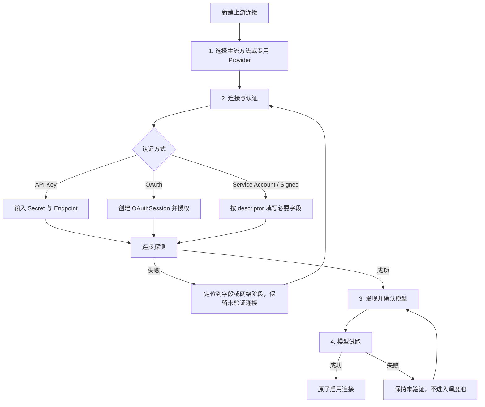
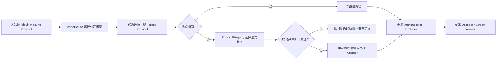
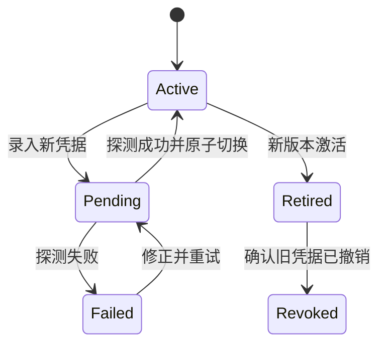

# AI Provider 管理面与配置使用流程重构设计

> 状态：本次管理面核心切换完成；四条主流方法、Provider Connection 管理入口、真实协议探测、统一 OAuthSession、凭据轮换、凭据状态投影和 Secret 不回显已在同一变更集中切换
>
> 范围：`done-hub` 的 AI Provider 管理面、配置 API、凭据生命周期、模型发现与映射、测试诊断、批量导入和审计
>
> 约束：与核心网关一次性交付；不做按 Provider 分批上线，不长期保留两套管理面；保留数据库回滚窗口，但不双写两套业务模型

---

## 1. 结论

当前核心网关已经建立 `ProviderDefinition`、`Endpoint`、`Credential`、`ModelRoute`、`Policy`、`HealthState` 等边界，但管理面仍然基本沿用旧 Channel 的“大表单 + 类型分支 + CSV/JSON 字符串”模型。现有 `/api/channel/provider_definitions` 和动态 Provider 下拉框只解决了“名称从哪里来”，没有解决“用户如何正确完成一条可工作的连接”。

管理面应一次性改造成：

1. **一个管理对象**：用户只管理“上游连接（Provider Connection）”，不直接拼装五张领域表。
2. **一个日常入口**：列表、创建、编辑、测试、模型同步、轮换均从“上游连接”进入。
3. **一条快速配置链**：选择 Provider → 连接认证 → 发现并确认模型 → 测试并启用。
4. **一套 Provider 元数据**：字段、认证方式、默认地址、能力、模型发现方式和校验规则都由后端 Registry 描述，前端不再写 Provider type ID 分支。
5. **一套凭据生命周期**：API Key、OAuth、Service Account 和签名凭据使用统一状态与轮换入口；Secret 永不回显。
6. **一套测试语义**：配置探测无副作用，启停是单独动作；错误必须能定位到 DNS、TLS、认证、模型或推理阶段。
7. **渐进披露高级能力**：默认只展示能建立连接的必要字段；代理、Header、参数覆盖、路由权重等进入“高级设置”。
8. **四条一等主流方法**：OpenAI Chat/兼容、OpenAI Responses、Anthropic Messages、Google Gemini 固定置顶，并拥有各自的配置、探测与直通请求链。

这不是把当前大弹窗拆成多个视觉卡片，而是把“表单字段驱动”改成“完成连接任务驱动”。

---

## 2. 调研范围与事实依据

### 2.1 当前项目

当前管理面主要事实：

- 渠道列表、过滤、批量操作集中在 `web/src/views/Channel/index.jsx`。
- 创建、编辑、标签批量覆盖、三套 OAuth、模型、映射、Header 和高级参数集中在 `web/src/views/Channel/component/EditModal.jsx`。
- Provider 元数据已经可从 `/api/channel/provider_definitions` 读取，但失败时会静默回退静态 `CHANNEL_OPTIONS`：`EditModal.jsx:175-195`。
- 表单校验仍然用 Provider 数字类型判断 BaseURL 等字段：`EditModal.jsx:62-85`。
- 保存前需要在数组、逗号字符串和 JSON 字符串之间来回转换：`EditModal.jsx:789-932,964-1045`。
- Gemini CLI、Claude Code、Codex OAuth 各自维护状态、轮询和回调交换：`EditModal.jsx:325-700`。
- 模型获取入口存在，但当前请求会强制以 OpenAI 类型获取：`web/src/views/Channel/component/ModelSelectorModal.jsx:160-177`。
- 渠道测试会同时承担测试、状态更新和错误展示，难以区分只读诊断与状态变更：`controller/channel-test.go:270-319`。
- 核心层已有 Provider descriptor：`internal/gateway/domain/types.go:49-65`；已有规范化资源：`model/gateway_resources.go:18-88`；但管理 API 仍以旧 Channel 为主。

### 2.2 new-api

可借鉴：

- 用中心化 Channel type metadata 表达名称、图标、默认 BaseURL、提示和部分校验：`example/new-api/web/src/features/channels/lib/channel-type-config.ts:25-167`。
- 创建/编辑抽屉按基础、凭据、模型、认证等区块导航：`example/new-api/web/src/features/channels/components/drawers/channel-mutate-drawer.tsx:1087-1125`。
- 支持单 Key、批量 Key、多个 Key 合并为一个 Channel 的录入模式：`example/new-api/web/src/features/channels/types.ts:374-378`。
- 有模型获取、复制、单独读取敏感 Key 的权限边界：`example/new-api/web/src/features/channels/api.ts:213-307`。
- 后端将读、操作、写、敏感写权限分开：`example/new-api/router/channel-router.go:19-78`。

应避开：

- 主编辑抽屉接近 4800 行，拆了视觉区块但没有真正拆业务边界。
- 前后端都存在 Provider type ID 硬编码，规则仍会漂移：`channel-form.ts:283-375` 与 `controller/channel.go:473-538`。
- Models、Mapping、Setting 等仍以逗号字符串或 JSON 字符串跨 API 传输。
- 部分业务错误仍使用 HTTP 200 envelope，字段错误和传输错误难以统一处理。
- “查看完整 Key”即使增加验证仍扩大了 Secret 暴露面；done-hub 不提供读取明文 Secret 的 API。

### 2.3 sub2api

可借鉴：

- 把认证过程做成明确的向导，并覆盖 OAuth、Refresh Token、Cookie、Service Account 等认证方式：`example/sub2api/frontend/src/components/account/OAuthAuthorizationFlow.vue:12-286`。
- 多文件/多凭据导入可先预览，并按条目显示名称、类型、代理和失败原因：`example/sub2api/frontend/src/components/admin/account/ImportDataModal.vue:9-92`。
- 状态不仅显示启停，还显示 429/529 倒计时、错误原因、模型额度和恢复时间：`example/sub2api/frontend/src/components/account/AccountStatusIndicator.vue:1-152`。
- 测试弹窗展示模型、模式、请求过程、输出和错误，接近真实调用诊断：`example/sub2api/frontend/src/components/account/AccountTestModal.vue:44-152`。
- 提供重新认证入口，而不是让用户删除后重建：`example/sub2api/frontend/src/components/account/ReAuthAccountModal.vue:51-121`。

应避开：

- 一次性把过多认证变体全部铺给用户，普通配置容易被高级流程淹没。
- Account、Platform、Group 等多层概念重叠，用户需要先理解内部模型才能配置。
- Provider 特例和默认模型映射散落在前后端，例如 Antigravity 的平台专用映射：`example/sub2api/backend/internal/domain/constants.go:75-100`。
- 允许直接导入较自由的凭据 JSON，若格式和日志边界不严密，会放大 Secret 泄露风险。
- “空模型白名单等于允许全部”会让上游新增模型在未经管理员确认时自动暴露。

### 2.4 CLIProxyAPI

可借鉴：

- Management API 路由集中，认证文件、OAuth 会话、状态、日志和路由配置边界清晰：`example/CLIProxyAPI/internal/api/server_management.go:24-175`。
- 核心项目把 WebUI 作为可替换的外部控制面，并把部分统计能力外置：`example/CLIProxyAPI/README_CN.md:127-141`。
- OAuth 会话有 state、状态查询、取消和 TTL：`example/CLIProxyAPI/internal/api/handlers/management/oauth_sessions.go:14-40`。
- 认证文件批量上传支持逐条结果：`example/CLIProxyAPI/internal/api/handlers/management/auth_files_crud.go:30-115`。
- 配置监听使用增量快照、去重和缓冲，避免每次变化全量重建：`example/CLIProxyAPI/docs/sdk-watcher_CN.md:5-23`。
- 模型别名、排除和路由策略是显式配置：`example/CLIProxyAPI/config.example.yaml:201-214,487-565`。

应避开：

- 项目本身没有稳定内置管理 UI，配置体验依赖外部 Dashboard 或直接编辑 YAML。
- 全局 Management Key、remote allow 开关更适合单机代理，不适合作为多用户后台的完整权限模型。
- 直接编辑一份全局 YAML 会放大并发覆盖、局部校验、审计和回滚成本。
- 认证文件下载/删除能力过强；done-hub 不提供 Secret 下载。
- 模型 alias/force/exclude 如果没有冲突检测，容易形成多层难以解释的重写链。

### 2.5 四条主流方法专项调研

这里需要区分两个概念：

- **Provider** 是实现和账号归属，例如 OpenAI、Azure、Anthropic、Google AI Studio、Vertex AI、Bedrock。
- **接入方法（Protocol Profile）** 是请求线协议，例如 OpenAI Chat Completions、OpenAI Responses、Anthropic Messages、Google Gemini GenerateContent。

当前 done-hub 的静态列表虽然把 OpenAI、Anthropic、Azure、Gemini 放在前部，但只是对象定义顺序，没有显式“主流协议”分区：`web/src/constants/ChannelConstants.js:1-42`。动态列表又直接渲染后端按 ChannelType 排序的 `ProviderDefinition`：`web/src/views/Channel/component/EditModal.jsx:175-195`、`internal/gateway/registry/provider.go:85-100`。因此它目前是“Provider 名称靠前”，还不是“主流方法一等化”。

请求链也仍有方法混用：

- `/v1/chat/completions` 和 `/v1/responses` 虽然都有入口，但 Chat 可由 `Need2ResponseModels`/Channel 开关转到 Responses，Responses 又可因 Provider 能力回退 Chat：`relay/chat.go:102-135,378-417`、`relay/responses.go:86-141`。
- Anthropic descriptor 同时声明 Claude Messages 和 OpenAI Chat，Gemini descriptor 同时声明 Gemini 和 OpenAI Chat：`providers/providers.go:69-78`；能力声明本身合理，但当前 RoutePlan 没有把“本次必须走哪条协议”完整固化。
- Gemini Provider 还可通过 `use_openai_api` 委托给嵌入的 OpenAI Provider：`providers/gemini/base.go:35-78`、`providers/gemini/chat.go:33-64`。

因此本次优化不能只调 Picker 顺序，还要让选择结果成为明确的 `protocol_profile_id` 和 `ModelRoute.Protocol`，贯穿探测、调度、Adapter 和流终止。

三个 example 的共同经验：

#### new-api

- 用固定 `CHANNEL_TYPE_DISPLAY_ORDER` 把 OpenAI、Anthropic、AWS、Gemini、Azure、Vertex 等主流项放在列表前部：`example/new-api/web/src/features/channels/constants.ts:86-109`。
- OpenAI、Anthropic、Gemini、Vertex 分别提供默认地址、Key 提示、区域和 Service Account 提示：`example/new-api/web/src/features/channels/lib/channel-type-config.ts:48-105`。
- 路由上 `/v1/messages`、`/v1/responses`、OpenAI Chat 和 Gemini 各自进入明确格式：`example/new-api/router/relay-router.go:87-105`。

不足是：Responses 没有成为选择页的一等方法；OpenAI 官方、OpenAI-compatible 和 Responses 兼容仍混在 Provider type 中，部分模型过滤继续依赖 type ID。

#### sub2api

- 创建账号先用分段控件突出 Anthropic、OpenAI、Gemini，再选择认证类型：`example/sub2api/frontend/src/components/account/CreateAccountModal.vue:70-163`。
- Anthropic 下再区分 OAuth、API Key、Bedrock、Vertex；OpenAI 下区分 OAuth 和 Responses API Key：`CreateAccountModal.vue:166-353`。
- 后端按 `/v1/messages`、`/v1/chat/completions`、`/v1/responses`、`/v1beta/models` 区分协议，并为 OpenAI-compatible 上游保存 Responses 探测结果，避免把只支持 Chat Completions 的服务错误发往 `/responses`：`example/sub2api/backend/internal/handler/endpoint_test.go:24-137`、`example/sub2api/backend/internal/pkg/openai_compat/upstream_capability.go:1-114`。

不足是：平台、账号类型、分组路由和 endpoint 多层叠加；OpenAI Responses 与兼容 Chat Completions 在部分 UI 中仍混在同一 API Key 类型下，未知能力默认尝试 Responses 也可能产生不必要失败。

#### CLIProxyAPI

- 四种协议在路由层就是一等入口：`/v1/chat/completions`、`/v1/messages`、`/v1/responses`、`/v1beta/models/*action` 分别进入专用 handler：`example/CLIProxyAPI/internal/api/server_routes.go:59-112`。
- OpenAI-compatible 作为独立配置类型管理 BaseURL、Key、模型与 alias：`example/CLIProxyAPI/config.example.yaml:441-475`。
- 跨协议转换由显式 Translator Registry 完成，而不是让 Provider Picker 猜测：`example/CLIProxyAPI/internal/translator/translator/translator.go:14-70`。

不足是：管理面依赖配置文件/外部 UI；Chat handler 仍会通过 payload 字段启发式识别 Responses 请求，模型 alias 合并也可能造成跨 Provider 歧义。

本设计采用的结论是：**四条主流方法必须同时在选择页、配置默认值、能力探测、模型发现、测试用例和运行请求链路成为一等对象；不能只把四个 Provider 名称视觉置顶。**

---

## 3. 1 对 3 全面对比

| 维度 | 当前 done-hub | new-api | sub2api | CLIProxyAPI | 本设计取舍 |
|---|---|---|---|---|---|
| 用户心智 | Channel 大表单 | Channel 大抽屉 | Platform + Account | 配置文件 + Auth file | 统一为“上游连接” |
| 主流方法入口 | OpenAI/Anthropic/Gemini 靠前但无协议分区，Responses 隐藏在能力中 | 主流 Provider 固定排序，Responses 未独立 | 平台分段突出，账号类型再细分 | 四种协议路由天然独立 | 四条 Protocol Profile 固定置顶，Provider 作为实现变体 |
| Provider 元数据 | 已能读取基础 descriptor，但字段仍硬编码 | 有较丰富 type metadata | 认证/平台分支丰富 | 配置 schema 分散在 YAML/handler | 后端 Registry 输出小而强类型的 UI descriptor |
| 快速创建 | 所有字段同屏，类型变化后动态变形 | 分区较清楚，但抽屉巨大 | 认证向导强 | 无统一内置 UI | 四步内完成，默认只显示必填项 |
| API Key | 单 Key 文本框 | 单/批量/多合一 | 支持批量和多种 token | Auth file | 单连接单凭据；批量 Key 创建多条独立连接 |
| OAuth | 三套前端实现 | 类型特例仍多 | 覆盖面强 | 会话状态机清晰 | 一个 OAuthSession 协议、一个前端组件 |
| 模型发现 | 有入口但存在强制 OpenAI 类型 | 可获取模型 | 可配白名单/映射 | alias/exclude 丰富 | Registry 指定发现器；先显示 diff，再显式确认 |
| 模型白名单 | 数组/逗号字符串 | 逗号字符串 | 空值常表示全部 | include/exclude 配置 | 默认显式列表；空列表不表示全部 |
| 模型映射 | JSON/数组转换 | 字符串/JSON | Provider 特例较多 | alias/force/exclude | 只允许一层 `public -> upstream`，保存时阻断冲突 |
| 测试 | 单次测试且可能影响状态 | 有测试接口 | 测试过程可视化强 | 状态 API | “连接探测”和“启停”完全分离 |
| 健康状态 | 启停、耗时、余额等散列 | 状态操作较全 | 冷却/错误/额度可解释性强 | 状态数据清晰 | 正常/降级/冷却/凭据过期/手动停用 |
| 凭据轮换 | 编辑 Key 覆盖旧值 | 可管理多 Key | 重新认证较完整 | 替换 Auth file | 新凭据先测试、原子切换、旧凭据退休 |
| 复制 | 复制渠道 | 有复制对话框 | 能批量操作 | 复制配置文件 | 复制非敏感配置，新连接保持未验证 |
| 批量导入 | 多入口，反馈不统一 | 批量创建 | 逐条反馈最好 | 批量 auth file | 先校验预览，再按条目提交；Secret 不进入导出 |
| 错误反馈 | toast 为主 | 局部处理不一致 | 条目错误较清楚 | API 状态清楚 | 字段错误 + 阶段错误 + 可复制诊断 ID |
| 权限 | 管理 API 粒度较粗 | 敏感写分权较好 | 管理后台权限 | 单全局密钥 | `read/operate/write/secret_rotate` 四类能力 |
| 审计 | 缺统一配置审计 | 部分操作日志 | 状态信息丰富 | 配置文件变化可观察 | 追加式审计，不记录 Secret |
| 实现复杂度 | 一个巨型 Modal | 巨型 Drawer | 多层组件与状态 | handler/YAML 边界较硬 | 领域服务 + 小型 descriptor + 任务型 UI |

综合判断：

- **new-api 最值得借鉴的是表单分区、复制、模型获取和敏感操作权限；最需要避开的是“巨型抽屉 + 两端硬编码”。**
- **sub2api 最值得借鉴的是认证向导、逐条导入反馈、可解释健康状态和测试过程；最需要避开的是“认证选项过载 + 多层内部概念”。**
- **CLIProxyAPI 最值得借鉴的是 OAuth 会话协议、认证文件生命周期和增量刷新；最需要避开的是“配置文件中心 + 全局管理密钥 + Secret 文件下载”。**

---

## 4. 管理面边界

### 4.1 用户只看见 Provider Connection

`Provider Connection` 是管理 API 的聚合，不新增一张重复业务表。它由服务层聚合：

```text
ProviderConnection
├── ProviderDefinition
├── Endpoint
├── Credential metadata
├── ModelRoutes[]
├── Policy
└── HealthState
```

前端不分别调用五套 CRUD，也不理解其数据库关系。创建或编辑一个连接时，后端在单一事务内更新相关领域资源。

### 4.2 名称收口

| 旧名称 | 新管理面名称 | 说明 |
|---|---|---|
| 渠道 / Channel | 上游连接 | 用户实际配置的是到一个 AI 服务的连接 |
| 分组 / Group | 访问分组 | 决定哪些用户/令牌可访问 |
| 标签 / Tag | 管理标签 | 只用于后台过滤和批量操作 |
| 模型重定向 | 模型映射 | `对外模型名 -> 上游模型名` |
| Key | 凭据 | 可为 API Key、OAuth、Service Account 或签名配置 |
| 测试渠道 | 连接探测 / 模型试跑 | 明确区分连接层与推理层 |

“访问分组”和“管理标签”不得再使用相似控件和相同文案，避免误把批量管理标签当成路由授权分组。

### 4.3 前端禁止承担的职责

- 不根据 Provider 数字 ID 判断必填字段。
- 不在浏览器中拼接 Provider 专用认证 JSON。
- 不把 models、mapping、headers 重新编码为逗号字符串或 JSON 字符串。
- 不决定 OAuth endpoint、scope、PKCE 或 token exchange 方式。
- 不决定哪些错误应自动禁用连接。
- 不读取、复制或下载已保存的明文 Secret。

---

## 5. 信息架构

```text
AI Provider
├── 新建连接
│   ├── 主流协议
│   │   ├── OpenAI Chat Completions（官方/兼容）
│   │   ├── OpenAI Responses API（官方/兼容）
│   │   ├── Anthropic Messages API
│   │   └── Google Gemini GenerateContent
│   └── 厂商专用与扩展
├── 上游连接
│   ├── 全部连接
│   ├── 需要处理
│   └── 已停用
├── 模型路由
│   ├── 对外模型
│   ├── 上游映射
│   └── 冲突与缺失
├── 批量导入
└── 操作记录
```

日常入口仍是“上游连接”。“模型路由”是跨连接排查视图，不是另一套配置入口；修改时仍回到所属连接，避免双入口写同一配置。

### 5.1 Provider Picker：主流协议优先区

新建连接首先选择“怎么说话”，再选择“连接到谁”。页面顶部固定展示四张主流协议卡：

| 固定顺序 | 主流方法 | 实现变体 | 默认配置体验 |
|---:|---|---|---|
| 1 | OpenAI Chat Completions | OpenAI 官方、OpenAI-compatible | 官方地址默认；兼容服务只需 BaseURL + Key |
| 2 | OpenAI Responses API | OpenAI 官方、Responses-compatible | 明确测试 `/v1/responses`，不因兼容 Chat 成功就判定可用 |
| 3 | Anthropic Messages API | Anthropic 官方、Messages-compatible | 默认 `/v1/messages`、`x-api-key`、`anthropic-version` |
| 4 | Google Gemini GenerateContent | Google AI Studio、Vertex AI | API Key 或 Service Account；原生 models/generateContent |

卡片展示协议名而不是模糊的“OpenAI 风格”：

```text
主流协议
┌────────────────────┐ ┌────────────────────┐
│ OpenAI Chat        │ │ OpenAI Responses   │
│ 官方 / 兼容服务    │ │ 工具与推理原生路径 │
└────────────────────┘ └────────────────────┘
┌────────────────────┐ ┌────────────────────┐
│ Anthropic Messages │ │ Google Gemini      │
│ Claude 原生协议    │ │ GenerateContent    │
└────────────────────┘ └────────────────────┘

厂商专用与扩展                              [搜索全部]
Azure · Bedrock · 各模型厂商 · Coding OAuth · 图像/视频 · 自托管
```

选择主流卡片后，第二层才显示实现变体。例如 OpenAI Chat 可选“OpenAI 官方”或“兼容服务”；Gemini 可选“Google AI Studio”或“Vertex AI”。Azure、Bedrock、Claude Code、Gemini CLI、Codex、图像/视频与国内模型厂商放在“厂商专用与扩展”，但搜索结果始终可达。

排序和分区不得写死在 React 中。后端返回 `featured`、`display_order` 和 `catalog_section`；前端只按 descriptor 渲染。四张卡的顺序属于后端契约测试，不能依赖 ChannelType 数字大小或对象插入顺序。

### 5.2 连接列表

默认列：

| 列 | 内容 |
|---|---|
| 连接 | 名称、Provider 图标、管理标签 |
| 状态 | 正常、降级、冷却、凭据过期、未验证、手动停用 |
| 认证 | API Key / OAuth / Service Account；只显示是否已配置和更新时间 |
| 模型 | 已启用数量、待同步数量、冲突数量 |
| 路由 | 访问分组、优先级、权重 |
| 最近探测 | 时间、阶段、延迟或错误分类 |
| 操作 | 试跑、编辑、同步模型、更多 |

列表支持当前项目已有的折叠筛选、批量选择和标签过滤，但默认只展示最常用过滤项。Provider、状态、访问分组和管理标签使用服务端结构化过滤，不再前端解析字符串。

### 5.3 连接详情

详情页/抽屉固定为四个任务区：

1. **连接与认证**：Provider、认证方式、BaseURL、代理、凭据状态。
2. **模型与访问**：模型发现结果、对外名、访问分组。
3. **路由与策略**：优先级、权重、流式支持、并发和高级参数。
4. **健康与记录**：最近测试、错误、冷却、轮换记录、审计。

四个区块是独立组件和独立后端 command，不再形成一个数千行、一次提交全部字段的大表单。

---

## 6. 快速配置使用流程

### 6.1 主流程



### 6.2 第一步：选择主流方法或专用 Provider

页面先展示：

- 四条固定置顶的主流协议卡；
- “厂商专用与扩展”分区；
- 搜索框；
- 最近使用；
- Provider 名称、接入协议和主要能力；
- “需要 OAuth”“需要区域”等简短徽标。

选择主流协议后再选择实现变体；例如 OpenAI Chat 选择官方或兼容服务，Gemini 选择 AI Studio 或 Vertex AI。专用 Provider 则直接进入其 descriptor 声明的配置。

`ProtocolProfile` 和 Provider 选择后都不可在已创建连接中直接修改。需要更换时使用“复制为新连接”，防止旧凭据、模型映射、协议字段和策略被错误复用。

### 6.3 第二步：连接与认证

默认字段最多只包含：

- 连接名称，自动给出可编辑建议值；
- 认证方式，若 Provider 只有一种则不显示选择器；
- Secret 或“开始授权”；
- BaseURL，仅在可配置或必填时显示；
- 区域/组织等 descriptor 声明的必要字段。

以下字段折叠到“高级连接设置”：

- HTTP/SOCKS 代理；
- 自定义 Header；
- 超时；
- 特定租户/部署 ID；
- TLS/证书选项；
- Provider 专用兼容开关。

BaseURL 规则：

- 使用 Registry 默认值时显示“使用默认地址”，不把默认值复制成用户配置。
- 自定义地址保存前必须通过 URL、scheme、userinfo、fragment 和 SSRF 策略校验。
- 新建连接的地址变化后，旧测试结果立即失效；编辑 active 连接时，新地址只作为候选配置探测，失败不会覆盖当前运行地址。

### 6.4 第三步：发现并确认模型

连接探测成功后自动发现模型；不支持发现的 Provider 由 descriptor 给出推荐模型模板。

界面分为：

- **可用模型**：默认勾选 Registry 推荐或上游明确返回的稳定模型；
- **模型映射**：可选修改对外名称；
- **未识别/冲突**：必须解决后才能启用；
- **高级能力**：图像、音频、Realtime、Task 等按能力分组。

关键规则：

1. 空列表表示“没有启用任何模型”，不表示全部。
2. `public_model` 在同一访问分组内必须可解释；多个连接提供同名模型是路由候选，不是映射冲突。
3. 一条连接内，一个 `public_model` 只允许映射到一个 `upstream_model`。
4. 不支持多层 alias 链，保存时直接扁平化为 `public -> upstream`。
5. 自动发现的新模型默认进入“待确认”，不会静默暴露给用户。
6. 上游消失的模型不会立即删除历史配置，而是标记“上游缺失”并退出新请求候选。

### 6.5 第四步：试跑并启用

试跑默认选择一个已确认模型，发送最小、非流式、低 token 请求；若连接声明流式能力，再提供可选流式检查。

成功页展示：

- DNS、TCP、TLS、认证、模型发现、推理各阶段结果；
- 首字节和总耗时；
- 上游 request ID；
- 选中的上游模型；
- 是否检测到 usage；
- “启用连接”主按钮。

失败时连接以“未验证”状态保存，不进入调度池；用户输入不会丢失。测试失败本身不修改其他已运行连接。

### 6.6 快速创建的操作预算

常见 API Key Provider 的目标是：

```text
选择主流方法 → 粘贴 Key → 连接探测 → 确认模型 → 试跑并启用
```

不包含思考和第三方授权时间，用户主动操作不超过 5 次，目标 60 秒内完成。BaseURL、访问分组和模型均采用安全默认值时，不要求用户先理解权重、映射、Header 或计费字段。

### 6.7 编辑现有连接

编辑流程不能让一次输错 BaseURL、代理或认证参数直接破坏正在承载流量的连接：

1. 名称、管理标签、备注等非运行字段可通过乐观锁直接修改。
2. BaseURL、代理、认证字段、关键 Header 和协议选项属于运行字段。
3. 运行字段先以候选 patch 调用 `validate-change`，使用当前 active credential 完成探测或试跑。
4. 成功后返回短期 `validation_token`；正式 PATCH 校验 token、连接 version 和 patch 摘要后原子生效。
5. 验证失败时不持久化候选配置，当前 active 配置和流量不受影响。

这里不建立通用草稿表、发布工作流或版本树。前端只保存当前编辑内容，后端只保存短期验证摘要；唯一持久配置仍是 active 版本。

### 6.8 四条主流方法的专属默认与测试

| 方法 | 默认 Endpoint | 认证 | 模型发现 | 必须通过的试跑 |
|---|---|---|---|---|
| OpenAI Chat Completions | 官方使用 `api.openai.com`；兼容服务必须填 BaseURL；路径默认 `/v1/chat/completions` | Bearer/API Key | `/v1/models` 或 descriptor discovery | Chat 请求与 `[DONE]` 流终止 |
| OpenAI Responses | 官方默认 `/v1/responses`；兼容服务必须单独声明支持 | Bearer/API Key | `/v1/models` + Responses capability probe | 非流 `response.completed`；流事件顺序与终止 |
| Anthropic Messages | 官方使用 `api.anthropic.com/v1/messages` | `x-api-key` + `anthropic-version`，或兼容认证 | `/v1/models` 或模板 | Messages 非流、SSE 事件和 usage |
| Google Gemini | AI Studio 使用原生 models/generateContent；Vertex 使用项目/区域地址 | API Key 或 Service Account | 原生 `/models` | `generateContent` 与 `streamGenerateContent` |

关键判定：

- OpenAI-compatible 的 `/v1/models` 成功，不代表 `/v1/responses` 可用。
- Responses-compatible 必须通过真实最小 Responses 请求后才能标记支持，不能从模型名或服务品牌推断。
- Anthropic-compatible 必须验证 Messages 请求头、版本头和 SSE 事件，不以 Chat Completions 转换成功代替原生验证。
- Gemini 卡只表示原生 Gemini/Vertex 方法；只提供 OpenAI-compatible 接口的 Gemini 代理应选择 OpenAI Chat 或 Responses 卡。
- 每条连接保存 `protocol_profile_id`、实际 Provider 和已验证的协议能力；运行时不再从模型名前缀猜测协议。

### 6.9 从配置选择到请求链路



请求链规则：

1. `/v1/chat/completions`、`/v1/responses`、Anthropic Messages 路由和 Gemini 原生路由直接确定入站协议。
2. `ModelRoute.Protocol` 明确记录目标协议；CandidateSelector 优先选择同协议连接。
3. 同协议路径不得先转成统一 OpenAI Chat 再转回去，避免工具调用、思考块、缓存、usage 和流事件丢失。
4. 跨协议只允许 `ProtocolRegistry` 已声明的一次转换，并记录转换质量；不允许多跳转换。
5. OpenAI Chat → Responses、Responses → Chat、OpenAI → Claude/Gemini 都是显式 RoutePlan，不再由 `Need2ResponseModels`、模型名前缀、payload 猜测或 Provider 类型断言临时决定。
6. 四条方法各自拥有 URL/Header/Body、非流结果、SSE 事件、终止帧和 usage 的 golden test。
7. 专用 Provider 可以实现其中一个或多个 Protocol Profile，但不能改变协议的全局语义。

---

## 7. 认证与凭据流程

### 7.1 统一认证描述

在现有 `ProviderDefinition` 上增加小型、强类型 descriptor，并新增由 Registry 汇总生成的 `ConnectionProfileDefinition`；不引入可执行脚本或无限制 JSON Schema：

```go
type ConnectionProfileDefinition struct {
    ID             string
    DisplayName    string
    Protocol       Protocol
    Featured       bool
    DisplayOrder   int
    CatalogSection string
    Variants       []ProviderVariant
}

type ProviderVariant struct {
    ProviderID      string
    DisplayName     string
    DefaultEndpoint string
    AuthSchemeIDs   []string
}

type AuthSchemeDefinition struct {
    ID          string
    DisplayName string
    Kind        AuthMode
    Fields      []FieldDefinition
    OAuth       *OAuthDefinition
}

type FieldDefinition struct {
    Key          string
    Label        string
    Type         FieldType
    Required     bool
    Secret       bool
    Placeholder  string
    HelpText     string
    Validation   ValidationRule
}
```

`ConnectionProfileDefinition` 只组织选择体验和协议默认值，不复制 Adapter 实现；`ProviderVariant` 引用已有 ProviderDefinition。Provider 特例通过后端实现的 validator 和 authenticator 完成；前端只渲染有限字段类型：text、secret、url、select、boolean、file-json。

### 7.2 API Key

- 创建时可输入，编辑时只显示“已配置”和更新时间。
- Secret 输入框永不使用已保存值占位。
- 未点击“替换凭据”时，编辑其他字段不会触碰 Credential。
- 替换时先创建 `pending` 凭据，探测成功后原子切换为 `active`。
- 日志、审计、错误、导出和复制均不包含原值或密文。

### 7.3 OAuth

统一后端协议：

```text
POST   /api/admin/oauth-sessions
GET    /api/admin/oauth-sessions/:id
POST   /api/admin/oauth-sessions/:id/cancel
POST   /api/admin/oauth-sessions/:id/exchange   # 仅需人工回填 code 的 Provider
```

统一状态：

```text
pending → authorized → exchanged
   ├── failed
   ├── expired
   └── canceled
```

规则：

- session 必须绑定当前管理员、Provider、auth scheme、state 和过期时间。
- 前端只有一个 OAuth 组件，统一处理弹窗、轮询、取消、过期和重试。
- 支持自动 callback 的 Provider 不显示 code 输入框。
- 只有 Provider 明确要求人工粘贴回调时才渐进显示手工交换。
- 页面关闭或用户取消时立即停止轮询；服务端 TTL 到期后清除临时材料。
- OAuth 成功不等于连接可用，仍需执行模型发现和最小试跑。

### 7.4 Service Account / Signed Request

- JSON 文件只在浏览器解析基础格式和大小，完整合法性由后端校验。
- 上传后只返回凭据类型、主体标识、过期时间和是否可刷新，不返回文件内容。
- AWS 等签名凭据按明确字段录入，不允许前端自由拼接 opaque JSON。

### 7.5 凭据轮换



为支持零中断轮换，当前 `GatewayCredential.ChannelID` 的一对一唯一约束（`model/gateway_resources.go:41-50`）必须改为一个连接可有多个版本，并由 Endpoint/Connection 明确引用唯一 active credential。运行时永远只读取 active 版本。

这是本次管理面改造中唯一必须调整现有规范化数据模型的凭据关系；不引入通用“凭据池调度”。多个 Key 负载均衡仍使用多条独立连接，保持健康、额度和审计可解释。

---

## 8. 模型同步与映射

### 8.1 同步不是“覆盖”

模型同步分两步：

1. `discover` 返回当前上游快照和与本地配置的差异；
2. 用户确认变更后才更新 `ModelRoute`。

差异类型：

| 类型 | 默认动作 |
|---|---|
| 上游新增 | 待确认，不自动公开 |
| 上游仍存在 | 保持当前启用和映射 |
| 上游移除 | 标记缺失，停止进入新候选；保留记录供修复 |
| 名称疑似替换 | 仅给建议，不自动改 alias |
| 对外名冲突 | 阻断提交并指出冲突连接/访问分组 |
| 能力变化 | 要求重新试跑相关协议 |

### 8.2 映射编辑器

每行只包含：

```text
[启用] 对外模型名  →  上游模型名  [能力] [状态]
```

支持搜索、批量勾选、按能力筛选和“恢复上游名称”。不提供多层重写规则、正则脚本或自由执行表达式。

### 8.3 自动跟随上游

高级选项可开启“自动跟随已确认模型”，但语义只允许：

- 已存在模型保持同步；
- 新模型仍待确认；
- 消失模型自动停用；
- 不自动生成对外 alias；
- 不改变访问分组或价格。

这样吸收 CLIProxyAPI 的增量刷新优点，同时避免配置文件 alias 链和 sub2api 的“空白名单即全部”风险。

---

## 9. 测试、健康与故障恢复

### 9.1 两类测试

| 测试 | 目的 | 是否发起推理 | 是否改变启停 |
|---|---|---:|---:|
| 连接探测 | DNS、TLS、认证、Endpoint、模型列表 | 尽量不发起 | 否 |
| 模型试跑 | 验证真实模型、协议、流和 usage | 是 | 否 |

手工测试永不自动启用或停用连接。启用、停用和故障恢复是显式 command。

### 9.2 结构化测试结果

```json
{
  "success": false,
  "stage": "authentication",
  "code": "UPSTREAM_CREDENTIAL_REJECTED",
  "message": "上游拒绝凭据",
  "latency_ms": 318,
  "request_id": "diag_xxx",
  "retryable": false,
  "field_errors": [
    {"field": "credential", "code": "invalid", "message": "请替换或重新授权"}
  ]
}
```

不将上游完整响应、Header、Secret、cookie 或 token 返回前端。原始诊断只按 request ID 留在受控服务端日志。

### 9.3 健康状态

不把生命周期、运行健康和待办原因塞进一个不断扩张的状态枚举，而是分成三个正交维度：

| 维度 | 值 | 语义 |
|---|---|---|
| `lifecycle` | `unverified / active / disabled` | 是否经过验证、是否由管理员允许进入调度池 |
| `health` | `unknown / healthy / degraded / cooldown` | 运行时观测到的健康结果 |
| `attention[]` | `credential_expiring / model_changes / test_stale` 等 | 需要管理员处理但不一定立即停流量的事项 |

列表上的“正常、降级、冷却、凭据过期、未验证、手动停用”是这三个维度的展示投影，不是数据库里互斥的单一状态。

OAuth `pending/expired/canceled` 属于临时会话，不混入连接持久状态。模型同步中的“发现中”也是请求状态，不建立复杂工作流表。管理员手动停用拥有最高优先级，后台健康恢复不能把它改回 active。

### 9.4 一键恢复

“需要处理”列表按建议动作分类：

- 重新授权；
- 替换凭据；
- 重新测试；
- 处理模型缺失；
- 等待冷却结束；
- 检查 Endpoint/代理。

操作完成后先试跑，再由用户确认恢复启用；系统不得因一次手工测试成功而绕过管理员的手动停用。

---

## 10. 批量配置、复制与导入导出

### 10.1 批量 Key

借鉴 new-api 的批量录入，但只支持“每个 Key 创建独立连接”：

```text
每行一个 Key
可选列：名称、BaseURL、访问分组、管理标签
```

不支持把多个 Key 塞进一个连接内部随机轮询。多条连接能分别维护健康、冷却、额度、权重和审计，复杂度更低。

### 10.2 两步导入

1. **校验预览**：解析文件，逐条显示 Provider、认证方式、名称、Endpoint、模型数、警告和错误。
2. **确认提交**：默认只允许全部有效后提交；用户可明确选择“仅导入有效项”，结果仍逐条返回。

导入接口使用 idempotency key，重复提交不会重复创建。

支持的输入应为有版本的 done-hub 模板；对 third-party auth file 只提供明确适配器，不接受任意 JSON 猜测。

### 10.3 复制

复制内容：

- Provider；
- BaseURL、代理等非敏感连接配置；
- 模型和映射；
- 访问分组、管理标签、权重和优先级；
- 高级策略。

不复制内容：

- Credential；
- OAuth refresh token；
- 最近健康状态、余额和错误；
- 审计身份。

新副本状态固定为 `unverified`。

### 10.4 导出

导出仅包含可重新配置的非敏感结构和 schema version。Secret、密文、token、cookie、授权文件、内部日志和上游完整错误全部排除。导入导出不承担备份 Secret 的职责。

---

## 11. 管理 API 设计

### 11.1 Provider descriptor

```text
GET /api/admin/connection-profiles
GET /api/admin/provider-definitions
GET /api/admin/provider-definitions/:id
```

`connection-profiles` 返回四条置顶方法和专用分类：

- profile ID、协议、`featured`、`display_order`、`catalog_section`；
- 官方/兼容/云平台等 Provider variants；
- 每个 variant 引用的 Provider ID；
- 默认 Endpoint、认证方式、模型发现和试跑规格；
- descriptor version。

`provider-definitions` 返回：

- ID、显示名、图标键；
- capabilities、protocols；
- auth schemes；
- endpoint fields 和默认值；
- 是否支持模型发现、OAuth、流测试；
- 高级字段；
- descriptor version。

四条 featured profile 的 ID 固定为：

```text
openai-chat-completions
openai-responses
anthropic-messages
google-gemini
```

前端缓存必须绑定 version；读取失败时显示“接入方法定义加载失败”，不得静默回退另一套静态能力表。可保留最小离线名称列表用于只读展示，但禁止在 descriptor 不可用时提交配置。

### 11.2 连接聚合

```text
GET    /api/admin/provider-connections
POST   /api/admin/provider-connections
GET    /api/admin/provider-connections/:id
PATCH  /api/admin/provider-connections/:id
DELETE /api/admin/provider-connections/:id

POST   /api/admin/provider-connections/:id/clone
POST   /api/admin/provider-connections/:id/enable
POST   /api/admin/provider-connections/:id/disable
POST   /api/admin/provider-connections/:id/probe
POST   /api/admin/provider-connections/:id/test-model
POST   /api/admin/provider-connections/:id/validate-change
POST   /api/admin/provider-connections/:id/discover-models
POST   /api/admin/provider-connections/:id/apply-model-diff
```

创建/编辑 DTO 必须包含 `protocol_profile_id`、`provider_id` 和结构化数组/对象，不接受逗号 models 或字符串化 mapping/settings。后端校验所选 Provider variant 是否属于该 profile、是否声明目标 protocol。

### 11.3 凭据

```text
POST /api/admin/provider-connections/:id/credentials
POST /api/admin/provider-connections/:id/credentials/:credential_id/test
POST /api/admin/provider-connections/:id/credentials/:credential_id/activate
POST /api/admin/provider-connections/:id/credentials/:credential_id/revoke
```

读取连接时仅返回：

```json
{
  "configured": true,
  "auth_mode": "api_key",
  "status": "active",
  "version": 3,
  "updated_at": "..."
}
```

没有 `GET secret`、`download credential` 或返回密文的接口。

### 11.4 批量与审计

```text
POST /api/admin/provider-connections/import/validate
POST /api/admin/provider-connections/import/commit
GET  /api/admin/provider-connections/export
GET  /api/admin/provider-audit-events
```

### 11.5 错误协议

使用正确 HTTP status：

- `400`：请求格式错误；
- `401/403`：认证/权限；
- `404`：资源不存在；
- `409`：版本或模型映射冲突；
- `422`：字段或 Provider 规则不合法；
- `429`：管理操作限流；
- `502/503/504`：上游或网络探测失败。

统一响应：

```json
{
  "error": {
    "code": "CONFIG_VALIDATION_FAILED",
    "message": "配置未通过校验",
    "request_id": "req_xxx",
    "field_errors": [
      {"field": "endpoint.base_url", "code": "invalid_url", "message": "仅允许 HTTP(S) 地址"}
    ]
  }
}
```

前端将 `field_errors` 绑定到字段；非字段错误进入当前步骤的结果面板，不只显示全局 toast。

### 11.6 并发与原子性

- Connection DTO 带 `version`，PATCH 使用乐观锁；冲突时提示重新加载差异。
- 影响运行的 PATCH 必须携带与候选 patch 摘要绑定的短期 `validation_token`，避免验证后提交另一份内容。
- Connection 聚合写入在一个数据库事务完成。
- Credential 激活只更新 active 引用，不让运行时读取 pending/failed 版本。
- Model diff 带 discovery snapshot ID，过期快照不能覆盖新配置。
- 启用前必须验证 descriptor version、active credential、至少一个 ModelRoute 和最近成功试跑。

---

## 12. 权限、安全与审计

### 12.1 最小权限

不一次引入复杂 RBAC 设计，只定义四个管理能力：

| 能力 | 允许操作 |
|---|---|
| `provider.read` | 查看非敏感配置、状态、诊断摘要 |
| `provider.operate` | 测试、同步、启停、取消 OAuth |
| `provider.write` | 创建、编辑、复制、删除、导入 |
| `provider.secret_rotate` | 新增/轮换/撤销凭据和重新授权 |

当前只有管理员角色时可映射为同一角色，但 API 边界先分开，避免未来再次拆路由。

### 12.2 安全规则

- 所有 Secret write-only。
- Provider descriptor 不允许包含可执行 JS、模板表达式或任意请求脚本。
- 自定义 Header 拒绝覆盖 `Host`、`Content-Length` 和由 Authenticator 管理的认证头，除非 Provider descriptor 显式允许。
- BaseURL、代理和回调地址执行 SSRF/协议/地址范围校验。
- OAuth state 一次性使用并绑定管理员会话。
- 导入文件限制大小、条数、扩展名和 schema version。
- 测试 prompt 固定或经过长度限制，不允许把管理面变成任意请求代理。

### 12.3 审计

追加式事件至少包含：

```text
actor, action, connection_id, resource_version,
changed_fields, result, request_id, created_at
```

`changed_fields` 只记录 `credential: replaced`、`models: +3/-1` 等摘要，不记录 Secret、密文或 OAuth code。

---

## 13. 前端组件边界

```text
features/provider-connections/
├── api/
│   ├── descriptors.js
│   ├── connections.js
│   ├── credentials.js
│   └── diagnostics.js
├── components/
│   ├── ConnectionList.jsx
│   ├── ConnectionStatus.jsx
│   ├── ProviderPicker.jsx
│   ├── AuthForm.jsx
│   ├── OAuthSession.jsx
│   ├── EndpointForm.jsx
│   ├── ModelDiscovery.jsx
│   ├── ModelRouteEditor.jsx
│   ├── DiagnosticTimeline.jsx
│   └── CredentialRotation.jsx
├── flows/
│   ├── CreateConnectionFlow.jsx
│   ├── EditConnectionView.jsx
│   └── ImportConnectionsFlow.jsx
└── schema/
    └── descriptorRenderer.js
```

约束：

- 流程组件负责编排 API 和步骤，不包含 Provider type switch。
- 字段组件只渲染 descriptor 允许的有限字段类型。
- OAuth 组件只实现通用 session 协议。
- 模型编辑器只读写结构化 `ModelRoute[]`。
- 状态组件只渲染后端结构化状态，不从错误字符串推断状态。
- 删除当前 `EditModal.jsx` 中对应的创建/编辑/OAuth/模型转换职责；不能保留其作为另一套长期入口。

---

## 14. 逐功能改动前后差异

本章是实施验收清单；每一个小功能都必须能对应到代码、API 和测试。

| 小功能 | 改动前 | 改动后 | 验收重点 |
|---|---|---|---|
| Provider 列表 | 后端 descriptor + 静态常量双来源，失败静默回退 | descriptor 是唯一可提交来源；离线列表只读 | 定义加载失败时不能保存 |
| Provider 选择 | 数字 type 驱动表单变化，靠定义顺序把部分厂商放前 | 四条主流 Protocol Profile 固定置顶，专用 Provider 独立分区 | 前端无 Provider type switch，顺序来自后端契约 |
| OpenAI Chat/兼容 | 与 OpenAI Provider、Custom 和 Responses 能力混合 | 单独主流卡；官方/兼容作为实现变体 | `/chat/completions` 真实试跑通过 |
| OpenAI Responses | 隐藏在 Provider capability、模型开关或自动转换中 | 单独主流卡和独立 capability probe | 不因 `/models` 或 Chat 成功误判支持 |
| Anthropic Messages | Provider 可走 Claude 原生或 OpenAI 转换，选择页不说明 | 单独主流卡；原生 Header、版本和 SSE 契约 | Messages 直通优先，不先转 OpenAI |
| Google Gemini | 原生 Gemini 与 `use_openai_api` 可混在同一 Provider | 单独原生卡；AI Studio/Vertex 变体；兼容代理走 OpenAI 卡 | GenerateContent 直通，认证方式明确 |
| 主流与专用 Provider | 所有 ChannelType 基本平铺 | 主流协议区 + 厂商专用与扩展区 | 专用 Provider 可搜索且不挤占四张主卡 |
| 协议选择 | 可能由模型名、payload、Channel 开关或类型断言决定 | 入站路由 + ModelRoute.Protocol + 显式 RoutePlan | 无未声明的启发式切换 |
| 跨协议转换 | Provider/Relay 中临时转换和回退 | ProtocolRegistry 单次显式转换，同协议直通优先 | 无多跳转换，转换质量可观察 |
| 新建入口 | 一个大弹窗容纳所有字段 | 四步任务流 | 常见 Provider 主动操作 ≤5 次 |
| 连接名称 | 手工必填 | 自动建议、可修改 | 名称冲突就地提示 |
| BaseURL | 特定数字类型硬编码必填，编辑可直接影响当前配置 | descriptor 声明规则；候选地址先测后原子替换 | URL/SSRF 校验一致，失败不影响流量 |
| API Key | 创建必填、编辑可能与整表单一起提交 | write-only；显式“替换凭据” | 普通编辑不改 Credential |
| OAuth | Gemini/Claude/Codex 三套状态和轮询 | 一个 OAuthSession API 和组件 | 取消、过期、重试语义一致 |
| Service Account | 易退化为自由 JSON | descriptor 限定字段/file-json | 保存后不回显原文件 |
| 批量 Key | 多入口、结果反馈不统一 | 每个 Key 创建独立连接，先预览再提交 | 逐条错误和幂等 |
| 多 Key 单连接 | 容易继续堆入 Channel | 本次明确不支持通用凭据池 | 用多连接 + 权重实现 |
| 模型获取 | 入口存在但可能强制 OpenAI 类型 | Registry 指定 Provider discovery | 非 OpenAI Provider 不伪装 |
| 模型列表 | 数组与逗号字符串互转 | `ModelRoute[]` 结构化传输 | 空列表不代表全部 |
| 新模型 | 可能随上游或空白名单隐式暴露 | 进入待确认 | 未确认模型不可路由 |
| 消失模型 | 容易覆盖/删除 | 标记上游缺失并退出候选 | 历史配置可追踪 |
| 模型映射 | JSON/数组转换、可形成隐式规则 | 单层 `public -> upstream` | 冲突保存前阻断 |
| 访问分组 | 与标签概念易混 | 明确命名和权限语义 | 不与管理标签共用文案 |
| 管理标签 | 标签编辑可能覆盖整个组 | 标签只做管理筛选；批量改动单独预览 | 保留危险操作确认 |
| 高级参数 | 与必填字段同屏 | 渐进披露 | 默认流程看不到无关字段 |
| Header | JSON/Map 输入且边界分散 | 结构化 key/value，敏感头受 descriptor 限制 | 禁止覆盖认证头 |
| Proxy | 普通字符串字段 | 高级连接字段，探测阶段单独诊断 | 错误能定位代理阶段 |
| 保存 | 一次把整张旧 Channel 提交 | Connection 聚合事务 + version；运行字段带 validation token | 无半更新领域资源，不提交未测变更 |
| 保存失败 | toast 为主 | 字段错误绑定 + 步骤结果面板 | 用户输入不丢失 |
| 连接探测 | 与渠道测试/状态有耦合 | 无副作用的网络与认证探测 | 不自动启停 |
| 模型试跑 | 结果粒度有限 | 分阶段时间线、最小真实推理、可选流测试 | 有 request ID 和脱敏结果 |
| 启用 | 可与保存/测试隐式关联 | 单独 command；前置条件明确 | 未验证连接不能入池 |
| 停用 | 单一状态开关 | 手动停用与冷却/故障分离 | 自动恢复不覆盖手动停用 |
| 健康状态 | 启停、测试耗时、余额散列 | 正常/降级/冷却/过期/未验证/停用 | 状态有建议动作 |
| 冷却 | 后台行为难解释 | 显示原因和恢复倒计时 | 与 RetryPolicy 同一错误类 |
| 编辑 | 重新打开大表单、加载并转换全部字段 | 四个任务区，按 command 局部修改 | 编辑模型不触碰 Secret |
| Provider 变更 | 大表单理论上可改类型 | 禁止原地改；复制为新连接 | 不复用错误凭据/策略 |
| 复制 | 容易复制 Key 或健康信息 | 只复制非敏感配置，新副本未验证 | Credential 为空 |
| 凭据轮换 | 覆盖旧 Key | pending 测试 → 原子激活 → retire 旧版本 | 运行请求不中断 |
| 重新认证 | 常需回到编辑流程 | 健康页直接发起统一 OAuth/凭据轮换 | 失败不影响当前 active |
| 批量启停 | 已有批量操作但反馈粒度有限 | 逐条 command 结果，失败不掩盖成功 | 显示部分成功摘要 |
| 导入 | 格式和 Secret 风险不清晰 | 版本化模板、校验预览、逐条提交 | 任意 JSON 不被猜测导入 |
| 导出 | 可能混入旧 Channel 敏感字段 | 明确非敏感结构导出 | 绝不包含 Secret/密文 |
| 删除 | 直接删除渠道 | 先显示模型/分组/流量影响，事务删除聚合 | 删除后无孤儿资源 |
| 配置冲突 | 后写覆盖前写 | version 乐观锁 + diff 提示 | 409 不静默覆盖 |
| 审计 | 缺统一记录 | actor/action/version/result 追加记录 | 无 Secret |
| API 错误 | success envelope、HTTP status 混杂 | 正确 HTTP status + 统一 error schema | 前端错误处理一致 |
| 权限 | 管理能力粒度粗 | read/operate/write/secret_rotate | Secret 操作独立授权 |
| 移动端 | 大表单滚动长 | 步骤流 + 单列任务区 | 主操作固定且不遮挡错误 |

---

## 15. 一步到位的实施边界

“一步到位”指同一次发布完成管理 API 和管理 UI 切换，不是把所有工作塞进一个文件或一个提交。

同一次交付必须包含：

1. 建立四条 `ConnectionProfileDefinition`，固定主流区顺序并覆盖官方/兼容/云平台实现变体。
2. 扩展 Provider descriptor，覆盖全部当前 Provider 的认证字段、Endpoint 字段、默认值、能力和模型发现能力。
3. 将四种协议写入 ModelRoute/RoutePlan；同协议直通优先，跨协议只走显式 ProtocolRegistry。
4. 建立 Provider Connection 聚合查询和事务 command。
5. 凭据改为一对多版本关系，支持 pending/active/retired/revoked 和原子轮换。
6. 建立统一 OAuthSession API，迁移 Gemini CLI、Claude Code、Codex 等现有 OAuth。
7. 模型发现、diff、结构化 ModelRoute 编辑和冲突校验。
8. 为四条主流方法建立独立 capability probe、非流/流试跑与 golden test。
9. 无副作用 probe、模型试跑和结构化诊断。
10. active 连接的运行字段使用候选配置验证和原子替换，不引入通用草稿工作流。
11. 新连接列表、快速创建、详情、轮换、导入和审计 UI。
12. 删除旧 EditModal 的 Provider 分支、OAuth 状态、CSV/JSON 转换和旧写入口。
13. 删除 `Need2ResponseModels`、payload 猜测和 Provider 类型断言对新 RoutePlan 的协议决策职责。
14. 旧 `/api/channel/*` 管理写接口在切换版本中停止供新 UI 使用；只保留明确回滚窗口，不长期双写。
15. 完成桌面/移动端、权限、并发编辑、Secret、OAuth、模型冲突和批量部分失败测试。

不纳入本设计：

- 通用工作流/审批引擎；
- 多层模型 alias DSL；
- 任意 Provider 脚本插件；
- 可下载的凭据文件；
- 多 Key 单连接凭据池；
- 按 Provider 分批切换的长期 feature flag；
- 另建一套与 Registry 独立的前端 Provider 配置表。

---

## 16. 量化收益预估

以下均为实施前目标区间，不是当前代码已经实现的测量值。

### 16.1 配置效率

| 指标 | 当前基线判断 | 目标 | 预计改善 |
|---|---|---|---|
| 四条主流方法选择 | 从大量 ChannelType 中辨认 Provider，再猜兼容协议 | 首屏固定四卡，协议与实现变体两层选择 | 选择错误减少 60%–80% |
| 常见 API Key Provider 首次配置 | 需理解大表单、模型、分组及高级字段 | 60 秒内、主动操作 ≤5 次 | 耗时减少 40%–60% |
| OAuth Provider 配置 | 三种不同交互，失败恢复不统一 | 单一授权流程、统一重试 | 耗时减少 30%–50% |
| 模型同步 | 获取后仍需人工辨别覆盖和映射 | 自动 diff + 显式确认 | 操作减少 40%–70% |
| 凭据轮换 | 编辑覆盖，失败可能影响现有连接 | 先测后切，旧凭据保留 | 计划停机接近 0 |
| 批量导入排错 | 失败反馈粒度不统一 | 逐条预览和结果 | 排错时间减少 50%–70% |

### 16.2 管理面瘦身

预计可删除或显著缩减：

- `EditModal.jsx` 中三套 OAuth 状态与轮询；
- Provider type ID 条件分支；
- models/mapping/headers 的 CSV/JSON 转换；
- 标签批量覆盖与单连接编辑的共享提交逻辑；
- 前端静态 Provider 能力配置；
- 多处 success/error toast 分支。

目标不是单纯减少总代码行，而是：

- 单个创建/编辑流程组件不超过约 500 行；
- Provider 专用前端分支减少 80%–95%；
- 管理面跨字段序列化代码减少 70%–90%；
- 旧大弹窗职责拆除后，管理面相关生产代码净减少约 15%–25%，即使新增诊断、轮换和审计界面。

### 16.3 流畅度

管理面不是网关请求数据面，本设计不宣称提高推理吞吐。可测的流畅度目标是：

- 列表首屏只请求连接摘要，详情和审计按需加载；
- descriptor 以 version 缓存，切换 Provider 不重复请求；
- 模型表采用分页/虚拟化，1000 个模型仍可搜索和选择；
- 表单局部 command 避免每次编辑重新提交完整 Channel；
- 前端交互 P95 小于 100 ms，不含网络；
- 普通管理 API P95 小于 300 ms，不含第三方探测；
- OAuth/探测/模型发现使用异步状态，不阻塞整个页面。

与当前大表单相比，预计创建/编辑页渲染和状态更新体感提升 20%–40%；真实数值需用 React Profiler、API tracing 和 100/1000 模型基准验证。

### 16.4 错误与问题减少

预计减少：

- Chat/Responses 能力误判和错误 endpoint：50%–75%；
- Anthropic/Gemini 原生字段在跨协议转换中丢失的问题：35%–60%；
- Provider 字段规则前后端漂移：60%–80%；
- 因 Secret 被整表单误覆盖导致的问题：70%–90%；
- OAuth 前端状态机重复导致的问题：50%–75%；
- 模型字符串/JSON 转换和空值语义问题：60%–85%；
- 配置保存成功、运行时才发现错误的问题：40%–65%；
- 批量操作无法定位失败项的问题：50%–70%；
- 管理面可归因缺陷总量：35%–55%。

这些区间高于“全部用户可见错误”的改善，因为 Provider 上游故障、网络波动和用户输入错误不会消失。对全部用户可见错误，保守预期仍是减少约 8%–18%，但错误的可定位性和恢复速度会有更明显改善。

### 16.5 测量方法

发布前后至少各采集 7 天，或每项覆盖不少于 100 次人工/自动配置任务：

- `time_to_ready`：开始创建到连接 ready；
- `step_retry_count`：每一步重试次数；
- `config_validation_failure_rate`；
- `runtime_config_error_rate`；
- `oauth_completion_rate`；
- `model_sync_conflict_rate`；
- `credential_rotation_failure_rate`；
- `mean_time_to_recover`；
- 管理 UI JS error、接口 4xx/5xx、P95 渲染/API 耗时；
- 每个 Provider 新增/修改需要触碰的前端和后端文件数。

没有这些数据前，所有百分比只能作为规划值，不能写成已兑现收益。

---

## 17. 验收标准

### 17.1 配置体验

- 新建页首屏按固定顺序展示 OpenAI Chat、OpenAI Responses、Anthropic Messages、Google Gemini 四张主流卡。
- 四张卡下方才展示厂商专用与扩展；搜索可以找到全部 Provider。
- 任一普通 API Key Provider 可在 60 秒、主动操作不超过 5 次的目标内完成配置。
- 用户不展开高级设置也能建立一条安全可用连接。
- OAuth 供应商共用一套前端 session 组件；取消、过期、失败和重试表现一致。
- 批量导入逐条显示结果，失败条目不会隐藏成功条目。

### 17.2 边界

- 前端搜索不到 Provider 数字 type 的业务条件分支。
- 前端不硬编码四张卡的 Provider type 和顺序，只渲染 `ConnectionProfileDefinition`。
- Provider 配置规则只来自 Registry descriptor 和后端 validator。
- 管理 API 不接受逗号 models 或字符串化 mapping/settings。
- UI 只操作 Provider Connection 聚合，不直接编排五张领域表。
- Secret 没有读取、复制、导出或下载路径。

### 17.3 正确性

- 四条主流方法都有独立的 endpoint、认证、请求、非流响应、SSE 终止和 usage golden test。
- 同协议候选优先直通；跨协议转换只发生在显式 RoutePlan 中且最多一次。
- OpenAI Chat 探测成功不会自动把连接标记为 Responses-compatible。
- 未通过试跑的连接不会进入运行时调度池。
- 手工 probe/test 不改变连接启停状态。
- 模型新增不会自动公开，模型消失不会静默删除配置。
- 凭据轮换失败不影响当前 active 凭据，成功切换是原子的。
- 并发编辑冲突返回 409，任何一方都不会被静默覆盖。
- 删除连接后不存在 Endpoint/Credential/ModelRoute/Policy/Health 孤儿记录。

### 17.4 可维护性

- 新增普通 Provider 只需注册后端 descriptor/validator/adapter，不修改创建流程、OAuth 轮询、模型表格或核心路由。
- 新增一个认证字段只使用受限 `FieldDefinition`，不向通用表单增加 Provider switch。
- 每个连接 command 有独立服务测试；每个 Provider descriptor 有完整性契约测试。
- 旧 `EditModal` 和旧 Channel 写入口不作为新管理面的隐藏兜底。

---

## 18. 最终界面示意

### 18.1 主流方法选择

```text
新建上游连接                                      1 / 4
────────────────────────────────────────────────────
主流协议

[ OpenAI Chat ]       [ OpenAI Responses ]
  官方 / 兼容服务        Responses 原生能力

[ Anthropic Messages ] [ Google Gemini ]
  Claude 原生协议        AI Studio / Vertex

厂商专用与扩展                              [搜索全部]
Azure · Bedrock · Coding OAuth · 模型厂商 · 图像/视频 · 自托管
```

### 18.2 快速创建

```text
新建上游连接                                      2 / 4
────────────────────────────────────────────────────
OpenAI                         API Key

连接名称    OpenAI Production
API Key     ••••••••••••••••          [替换/粘贴]
服务地址    使用 Provider 默认地址      [自定义]

▸ 高级连接设置

连接探测
✓ DNS  23ms   ✓ TLS  81ms   ✓ 认证  146ms

                         [上一步] [继续：选择模型]
```

### 18.3 模型确认

```text
已发现 18 个模型                    [重新发现]
────────────────────────────────────────────────────
[✓] 对外名称           上游名称            能力
[✓] gpt-4.1            gpt-4.1             Chat
[✓] text-embedding-3   text-embedding-3     Embedding
[ ] gpt-image-1        gpt-image-1          Image

待处理
! old-model            上游已不存在         [移除]

访问分组  default

                         [上一步] [试跑并启用]
```

### 18.4 需要处理

```text
Anthropic Production
凭据即将在 3 天后过期
当前流量仍使用 active credential v4

[重新授权]  [查看最近错误]  [暂不停用]
```

---

## 19. 一句话验收

管理面重构完成后，OpenAI Chat/兼容、OpenAI Responses、Anthropic Messages、Google Gemini 四条主流方法在选择、配置、探测和请求链路中均为一等对象；管理员不需要理解 Channel 表、Provider type ID、CSV/JSON 字符串和五类网关资源，就能通过一条可诊断、可恢复、Secret 不回显的流程建立并维护上游连接。

---

## 20. 本次代码落地记录

### 20.1 配置入口

- 新增后端权威 `ConnectionProfileDefinition`，四张主流协议卡顺序固定为 OpenAI Chat、OpenAI Responses、Anthropic Messages、Google Gemini。
- 每张卡下再选择官方、兼容或云平台实现；其他 Provider 放入“厂商专用与扩展”，不再与四条主流方法平铺。
- 新建连接时由 descriptor 填入默认 BaseURL 和建议名称；已创建连接禁止原地修改 Profile/Provider，避免旧凭据、模型映射和协议策略串用。
- Provider catalog 加载失败时禁止保存，不再静默退回前端静态类型表。

### 20.2 创建、探测与批量 Key

- 新增 `POST /api/admin/provider-connections/probe`，草稿无需先持久化即可执行无副作用真实试跑。
- OpenAI Chat、Responses、Anthropic Messages、Gemini 分别走自己的请求格式和目标路径；Responses 不再因模型列表成功而被推断为可用。
- 探测成功返回 10 分钟短期 HMAC 验证令牌；新管理 API 在服务端校验令牌和关键字段摘要。修改 Provider、Profile、Key、BaseURL、Proxy、Other 或测试模型后必须重测，不能绕过 UI 直接创建。
- 批量 Key 逐条探测并汇总失败；任意一条失败时整批不保存。

### 20.3 Provider Connection 管理 API

新 UI 的连接列表、创建、读取、编辑、删除、复制、探测、启停、调度字段、批量删除和凭据轮换统一进入 `/api/admin/provider-connections*`。旧 `/api/channel/*` 仅作兼容入口：旧 POST 与新 POST 共用服务端探测令牌门禁，旧 PUT 不能替换凭据；新 UI 不再使用旧写入口。

复制连接只复制非敏感配置：副本不带凭据、保持手动停用；没有 active credential 或模型路由时，后端拒绝启用。

### 20.4 凭据生命周期

- `GatewayCredential` 从一连接一行改为 `(channel_id, secret_version)` 多版本。
- Endpoint 明确保存 `active_credential_id`；运行快照只解密这一版本。
- `auth_mode=none` 也创建无 Secret 的活动 Credential，使 Endpoint 始终满足统一引用不变量；只有 descriptor 声明允许匿名的 Provider 才能启用。
- 新凭据状态流为 `pending → tested pending → active`，切换时原 active 在同一事务变为 `retired`。
- 测试失败标记 `failed`，不会修改运行凭据；非 active 版本可撤销，active 版本必须先切换后才能撤销。
- Credential 激活、OAuth 自动刷新和初始迁移都不向 `channels.key` 回写明文；旧 Provider 所需 Key 只在请求/测试内存对象中按需水合。
- 连接详情、标签组详情、标签成员列表和凭据列表均不返回明文或密文 Secret；普通配置 PATCH 也不能隐式替换 Key。

### 20.5 历史数据与请求链

- 启动时为历史连接一次性补齐可确定的 `protocol_profile_id`，并同步刷新 Endpoint 和 ModelRoute；原生专用但不属于四条主流方法的 Provider 不被错误套用 Profile。
- 入站路由明确记录 Chat、Responses、Claude、Gemini 协议，候选连接按 Profile 过滤。
- 同协议优先直通；Chat ↔ Responses、Chat → Claude/Gemini 等现有转换只有在 Registry 明确声明时才可被选择，单请求不允许多跳。
- `Need2ResponseModels` 仅保留给没有 Profile 的回滚兼容数据；新 Responses Profile 不再依赖模型名前缀或隐藏开关。

### 20.6 本次验证

已通过：

```text
go test ./internal/gateway/... ./providers ./controller ./model ./relay ./relay/task ./relay/relay_util
bun build <5 个管理面 JSX 入口> --external '*'（语法与模块转换检查）
git diff --check
```

管理面生产 bundle 尚未验证：当前 `web/node_modules` 缺少 Vite，`npm ci` 同时被 React peer dependency 冲突和不同步的 `package-lock.json` 阻断。完整 `go test ./...` 仍被空 `web/build`、远程 JPEG fixture，以及通知/OSS/Ali Provider 测试环境初始化问题阻断；本次涉及的网关、Provider、管理 API、模型和 Relay 包均已通过。

### 20.7 统一 OAuthSession 与 descriptor 驱动

- 后端只保留一组管理会话入口：创建、手工交换、状态查询和取消统一位于 `/api/admin/provider-connections/oauth-sessions/:provider*`。公共回调也进入同一 Strategy dispatcher；Gemini CLI/Antigravity 仅保留身份平台已登记的旧 callback URI 作为无业务逻辑的兼容别名，避免 `redirect_uri_mismatch`。
- Gemini CLI、Antigravity、Claude Code、Codex、Copilot 以 Strategy 注册；浏览器回调、手工回调和 device code 是同一会话协议的三种 flow，不再暴露五套管理路由。
- `ProviderDefinition` 新增 `base_url_policy`、`defaults`、`oauth.provider`、`oauth.flow`。前端必填规则、默认 `other` 和 OAuth 流程只读取 descriptor。
- `OAuthCredentialFlow.jsx` 统一创建会话、打开/复制授权入口、回调交换、轮询、取消与资源清理；`EditModal.jsx` 不再保存任何厂商 OAuth 状态。
- `EditModal.jsx` 同时拆出高级配置和计费配置区，文件由改造前约 2420 行降为 1452 行。

### 20.8 本轮小功能改动前后差异

| 小功能 | 改动前 | 改动后 | 验证 |
|---|---|---|---|
| OAuth 管理 API | Gemini CLI、Antigravity、Claude Code、Codex、Copilot 各有独立 start/status/exchange/poll 路由 | 一套 OAuthSession 管理路由，Provider Strategy 只处理厂商交换细节；外部已登记 callback URI 只做 dispatcher 别名 | 旧 start/status/exchange/poll 路由搜索为零；Strategy registry 单测覆盖五家 |
| OAuth 前端状态 | 三组 state、dialog、callback、polling 和复制逻辑集中在 EditModal | 一个 `OAuthCredentialFlow` 支持 browser/manual/device 三种 flow | JSX 静态构建通过；旧 endpoint 与数字类型条件搜索为零 |
| BaseURL 必填 | Yup 直接判断 type 3/8 | 读取 `ProviderDefinition.base_url_policy` | descriptor 元数据单测覆盖 Custom/Azure |
| Provider 默认值 | 保存前直接判断 type 3/18 并写入 `other` | Registry 输出 `defaults`，选择和保存统一应用 | descriptor 元数据单测覆盖默认值 |
| OAuth Provider 选择 | type 57/58/59/60 决定 endpoint、事件类型和弹窗 | descriptor 的 `oauth.provider` 与 `oauth.flow` 决定通用组件行为 | EditModal 无 Provider 数字 ID 业务条件 |
| OAuth 回调消息 | Gemini CLI 与 Antigravity 使用不同 postMessage type | 统一 `provider_oauth_result`，消息携带 provider | callback 快速路径与状态轮询共用幂等门闩 |
| Copilot device flow | 单独 POST poll，结果字段只叫 `github_token` | 统一 GET session status，并输出通用 `credentials` | controller 编译与 Strategy 单测通过 |
| 连接列表凭据可见性 | 运营只能看到启停，无法区分缺失、免凭据和已验证 | 列表及标签成员显示已配置、免凭据、缺失、混合状态和最近验证时间 | Gateway Credential 摘要水合单测通过 |
| 列表查询成本 | 若逐行补凭据会产生 N+1 | 当前页批量查 Endpoint 与 active Credential；标签代表行一次聚合成员 | model 单测和 race 测试通过 |
| EditModal 维护边界 | 约 2420 行，OAuth/高级/计费均在单文件 | 主文件 1452 行；OAuth、高级、计费各自独立 | `wc -l` 与 6 个管理面 JSX 入口静态构建 |
| BaseURL 服务端准入 | 只在前端按 descriptor 显示必填；直接调用 API 可跳过 required/forbidden，默认值也不会落库 | `ValidateChannelConfig` 先应用 descriptor defaults，再统一执行 required/optional/forbidden 和 URL 安全校验；创建、编辑、标签编辑和草稿探测共用 | required、optional、forbidden、默认值和显式值不覆盖单测 |
| 非列表凭据水合 | `GetAllChannels`、`GetChannelsByTag` 按连接逐个查询 active credential，形成 N+1 | 一次批量读取 Endpoint、一次批量读取 Credential，并复用单个 Secret cipher；缺失或不可解密时保留迁移兼容值 | 三连接固定为 2 条查询，覆盖有 Key、keyless 和资源缺失 |
| 标签成员表维护边界 | `TableRow.jsx` 约 1993 行，标签成员表和通用单元格全部内联 | 标签成员表拆为 `TagChannelsPanel`，凭据/订阅额度/余额/组内编辑拆为 `ChannelTableCells`；主行文件降至约 1460 行 | 8 个管理面 JSX 入口静态构建 |
| 无引用旧组件 | `ChannelTable.jsx`、`TagTableRow.jsx` 已退出渲染链但仍留在仓库，其中旧表还有失效 import | 删除两份死代码，列表唯一入口保持 `index.jsx → TableRow.jsx` | 全仓静态/动态 import 搜索无引用 |

本轮新增验证：

```text
go test ./controller ./providers ./model ./internal/gateway/... ./router
go test -race ./internal/gateway/... ./providers ./model ./controller
bun build <8 个管理面 JSX 入口> --external '*'
git diff --check
```
